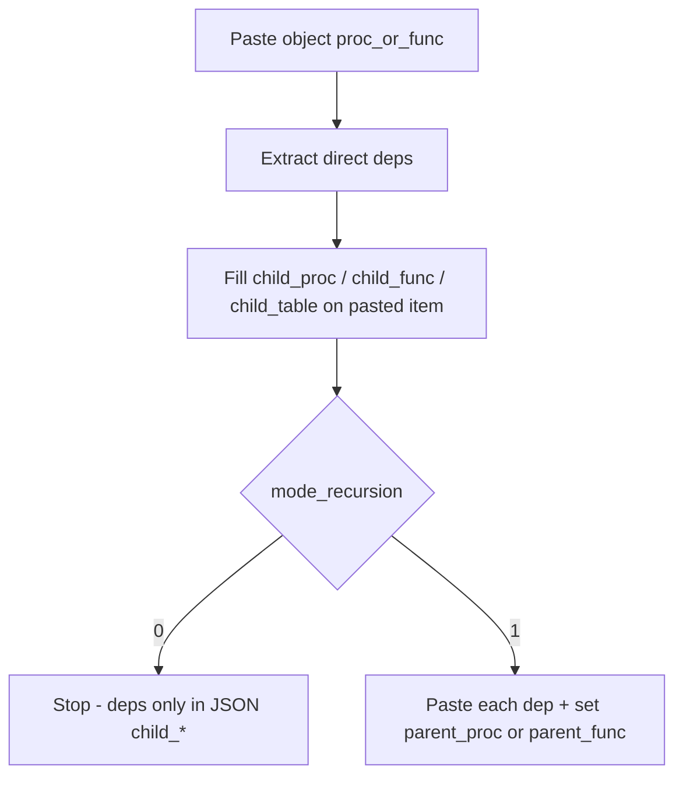

# 13 — type=1 bổ sung: quan hệ `parent_*` / `child_*` trên JSON (proc / func / table)

> **Vai trò:** BA + Tester — **file spec bổ sung** để Gemini (hoặc pass sau doc 12) implement.  
> **Không** sửa [`12_type1_xml_mode_get_recursion.md`](./12_type1_xml_mode_get_recursion.md) hay các `.md` cũ (`11`, `02`, `04`, …) trong phase này — Gemini có thể đang implement 12 song song.  
> **Phụ thuộc:** Doc [12](./12_type1_xml_mode_get_recursion.md) (XML seed, `mode_get`, `mode_recursion`) + nền type=1 ([11](./11_type1_paste_for_edit.md)).  
> **Phạm vi code:** [`clone_things/service.py`](../../../clone_things/service.py) (nhánh type=1 / queue deps), JSON `pasted[]`; tests `tests/clone_things/test_type1_*rel*.py` hoặc mở rộng file test type=1.  
> **Không** đổi type=0 response shape.

---

## 0. Vì sao tách file 13

Doc 12 đã chốt paste XML + `mode_get` + `mode_recursion` (paste deps khi `=1`).  
User cần thêm: **cây quan hệ cha–con trên JSON** (proc / func / table), và **điền `child_*` cả khi `mode_recursion=0`** để agent nắm deps nhanh mà chưa cần paste hết vào `.sql`.

File 13 **chỉ** mô tả contract quan hệ + AC; không lặp lại toàn bộ flow 12.

---

## 1. WHY

| Nhu cầu | Giải pháp |
|---------|-----------|
| Agent biết proc A gọi B, C, fn_x, dmkh mà **không** đọc full SQL | `pasted[]` của A có `child_proc` / `child_func` / `child_table` |
| Biết B/C được kéo từ đâu khi recursion=1 | B/C có `parent_proc` hoặc `parent_func` |
| Recursion=0 vẫn hữu ích | Phân tích deps **luôn** (sau khi paste seed proc/func); chỉ **không** paste deps vào file |

---

## 2. Quan hệ với `mode_recursion` (doc 12)

| | `mode_recursion=0` | `mode_recursion=1` |
|--|--------------------|--------------------|
| Paste `.sql` | Chỉ **seed** | Seed + **deps** (như type=0 / doc 12) |
| Phân tích deps trên mỗi proc/func **đã paste** | **Bắt buộc** | **Bắt buộc** |
| Điền `child_proc` / `child_func` / `child_table` (/`child_view`) trên cha | **Có** | **Có** |
| Dep có mặt trong `pasted[]` | **Không** (chỉ tên trong `child_*`) | **Có** + `parent_proc` hoặc `parent_func` |



**Lưu ý:** `mode_get` (doc 12) **không** cắt danh sách `child_*`. Agent luôn thấy full direct deps của object đã paste (trừ noise / exclude giống type=0 deps).

---

## 3. Contract field trên `pasted[]`

### 3.1. Con — tách theo kind

| Field | Type | Mô tả |
|-------|------|--------|
| `child_proc` | `string` optional | Proc con **trực tiếp**, join `,` — vd. `"dbo.B,dbo.C"` |
| `child_func` | `string` optional | Func con trực tiếp — vd. `"dbo.fn_x"` |
| `child_table` | `string` optional | Table con trực tiếp — vd. `"dbo.dmkh,dbo.m81$000000"` |
| `child_view` | `string` optional | View con trực tiếp (nếu extractor có) |

Quy tắc:

- **Omit** field nếu kind đó không có phần tử (không gửi chuỗi rỗng).
- Tên normalize `schema.name` (default schema `dbo`).
- Chỉ **cạnh trực tiếp** (1 hop từ object đang analyze).
- Thứ tự = thứ tự phát hiện / ổn định theo extractor hiện có.
- Object **table** (DDL) thường không có `child_*` (omit); nếu sau này extractor có FK — ngoài scope v1 file 13.

### 3.2. Cha — trên object được paste vì là dependency

| Field | Khi nào có | Giá trị |
|-------|------------|---------|
| `parent_proc` | Cha expand là **PROCEDURE** | `"dbo.A"` |
| `parent_func` | Cha expand là **FUNCTION** | `"dbo.fn_parent"` |

Quy tắc:

- Seed / object không ai enqueue → **không** có `parent_*`.
- Một phần tử chỉ có **một** trong hai field (không đồng thời).
- Dep là table/view/proc/func → vẫn dùng `parent_proc` hoặc `parent_func` theo **loại cha** (không invent `parent_table`).
- Nhiều cha cùng reference: **cha enqueue đầu tiên** thắng; optional `warnings` nếu phát hiện cha khác sau đó.

### 3.3. Khi nào chạy analyze

Sau khi **paste thành công** (hoặc sau khi xác định script) một object là proc hoặc func:

1. `deps = extract_object_dependencies(...)` — **reuse** logic type=0 / doc 12.
2. Phân loại từng dep → gom vào `child_proc` / `child_func` / `child_table` / `child_view`.
3. Gán các field đó vào **phần tử `pasted[]` của cha** (kể cả recursion=0).
4. Nếu `mode_recursion=1`: enqueue + paste deps; mỗi dep pasted nhận `parent_proc` hoặc `parent_func`.

Object vào `skipped_already_in_file`:

- Không bắt buộc `child_*` trên skip item.
- Nếu recursion=1 và vẫn muốn kéo deps từ object đã có trong file: **được phép** fetch/analyze để enqueue deps + điền quan hệ trên object **mới paste**; AC không bắt `child_*` trên skip entry.

---

## 4. Sample JSON

### 4.1. `mode_recursion=0` — chỉ seed A, vẫn có child_*

Proc A gọi B, C, `fn_x`, `dmkh`:

```json
{
  "success": true,
  "type": 1,
  "mode": "paste_for_edit",
  "mode_seed": "xml",
  "path_to_pasted": "E:\\\\SQL Temp\\\\showa_fbisp242 (8).sql",
  "pasted": [
    {
      "name": "dbo.A",
      "object_type": "SQL_STORED_PROCEDURE",
      "db": "app",
      "line_start": 10,
      "line_end": 80,
      "script_style": "alter",
      "child_proc": "dbo.B,dbo.C",
      "child_func": "dbo.fn_x",
      "child_table": "dbo.dmkh"
    }
  ],
  "skipped_already_in_file": [],
  "not_found_source": [],
  "warnings": [],
  "agent_message": "Đã paste 1 object vào E:\\SQL Temp\\showa_fbisp242 (8).sql. Xem child_proc/child_func/child_table để biết deps; recursion=0 chưa paste deps. User tự F5.",
  "meta": {
    "mode_get": "proc",
    "mode_get_kinds": ["proc"],
    "mode_recursion": 0,
    "execute_clone": false
  }
}
```

### 4.2. `mode_recursion=1` — paste A + deps + parent_*

```json
{
  "pasted": [
    {
      "name": "dbo.A",
      "object_type": "SQL_STORED_PROCEDURE",
      "db": "app",
      "line_start": 10,
      "line_end": 80,
      "script_style": "alter",
      "child_proc": "dbo.B,dbo.C",
      "child_func": "dbo.fn_x",
      "child_table": "dbo.dmkh"
    },
    {
      "name": "dbo.B",
      "object_type": "SQL_STORED_PROCEDURE",
      "db": "app",
      "line_start": 82,
      "line_end": 120,
      "script_style": "alter",
      "parent_proc": "dbo.A"
    },
    {
      "name": "dbo.C",
      "object_type": "SQL_STORED_PROCEDURE",
      "db": "app",
      "line_start": 122,
      "line_end": 160,
      "script_style": "alter",
      "parent_proc": "dbo.A"
    },
    {
      "name": "dbo.fn_x",
      "object_type": "SQL_SCALAR_FUNCTION",
      "db": "app",
      "line_start": 162,
      "line_end": 190,
      "script_style": "alter",
      "parent_proc": "dbo.A"
    },
    {
      "name": "dbo.dmkh",
      "object_type": "USER_TABLE",
      "db": "app",
      "line_start": 192,
      "line_end": 210,
      "script_style": "create",
      "parent_proc": "dbo.A"
    }
  ],
  "meta": { "mode_recursion": 1 }
}
```

### 4.3. Đa tầng A → B → D (recursion=1)

- `A.child_proc` chứa `dbo.B` (không bắt buộc liệt kê D).
- Sau khi paste B và analyze B: `B.child_proc` chứa `dbo.D`; `D.parent_proc` = `"dbo.B"`.

---

## 5. `agent_message` (gợi ý)

- Recursion=0 có `child_*`: nhắc agent xem `child_proc` / `child_func` / `child_table`; nếu cần paste deps thì gọi lại với `mode_recursion=1` (hoặc type=1 list tên con).
- Recursion=1: nhắc sửa theo `line_start`–`line_end`; quan hệ nằm trên `parent_*` / `child_*`.

---

## 6. Acceptance criteria

| ID | Given | Then |
|----|--------|------|
| AC-13-01 | Paste proc A, recursion=0, A gọi B,C + fn + table | `pasted` chỉ A; A có đủ `child_proc` / `child_func` / `child_table` tương ứng |
| AC-13-02 | Cùng A, recursion=1 | `pasted` gồm A và deps; A có `child_*`; mỗi dep có `parent_proc="dbo.A"` (nếu A là proc) |
| AC-13-03 | Cha là function `fn_p` gọi table T, recursion=1 | T có `parent_func="dbo.fn_p"` |
| AC-13-04 | A không có dep | Không có field `child_*` trên A |
| AC-13-05 | Đa tầng A→B→D, recursion=1 | `D.parent_proc` = B; A không ghi D trong `child_proc` trừ khi A gọi trực tiếp D |
| AC-13-06 | `mode_get=proc` nhưng A gọi table | `child_table` vẫn có trên A (không bị mode_get cắt) |
| AC-13-07 | type=0 | Không bắt buộc / không thêm `child_*` vào `cloned[]` (ngoài scope) |

---

## 7. Test cases

| ID | Priority | Mô tả |
|----|----------|--------|
| TC-T1-REL-01 | P0 | recursion=0 → child_* có, len(pasted)==seed |
| TC-T1-REL-02 | P0 | recursion=1 → parent_proc trên deps + child_* trên cha |
| TC-T1-REL-03 | P0 | Phân loại dep → đúng field child_proc/func/table |
| TC-T1-REL-04 | P1 | parent_func khi cha là function |
| TC-T1-REL-05 | P1 | Đa tầng parent trực tiếp |
| TC-T1-REL-06 | P1 | mode_get không cắt child_table |

File gợi ý: `tests/clone_things/test_type1_parent_child_relations.py`.

---

## 8. Implementation checklist (Gemini — sau hoặc cùng pass với 12)

- [ ] Sau paste proc/func: luôn `extract_object_dependencies` → fill `child_*` trên item `pasted[]`
- [ ] `mode_recursion=0`: **không** enqueue paste deps; **có** `child_*`
- [ ] `mode_recursion=1`: enqueue/paste deps + set `parent_proc` \| `parent_func`
- [ ] Normalize tên; omit field rỗng
- [ ] Unit TC-T1-REL-*
- [ ] Không sửa md 12 trong PR nếu đang conflict — implement theo 12 + 13

---

## 9. Prompt Gemini (copy-paste)

```text
Bạn là implementer FastBusiness MCP (repo E:\PythonProject\mcp_fbo).

Nhiệm vụ: bổ sung quan hệ parent/child trên JSON type=1 theo:
docs/doc/clone_things/13_type1_parent_child_relations.md
(Giữ nguyên / hoàn thiện doc 12 nếu đang làm dở — KHÔNG rewrite md 12/11.)

Yêu cầu cứng:
1) Sau khi paste mỗi proc/func: luôn phân tích deps trực tiếp → điền child_proc, child_func, child_table (child_view nếu có) trên pasted[] của cha.
2) mode_recursion=0: VẪN điền child_*; KHÔNG paste deps vào .sql.
3) mode_recursion=1: paste deps + parent_proc hoặc parent_func trên từng dep (theo loại cha).
4) mode_get không cắt danh sách child_*.
5) Omit field nếu không có con/cha. Normalize dbo.name. Cạnh trực tiếp only.
6) Tests TC-T1-REL-* trong tests/clone_things/test_type1_parent_child_relations.py.
```

---

## 10. Ngoài phạm vi

- Không implement trong phase chỉ viết doc 13.
- Không sửa file 12 / 11 / README trong phase này.
- Không multi-parent array; không graph JSON tách riêng (đủ field trên `pasted[]`).
