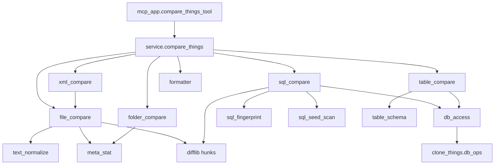

# 03 — Architecture: package `compare_things/`

## 1. Nguyên tắc

1. **Một folder chung** `compare_things/` (top-level repo, cạnh `clone_things/`).
2. **Tách file theo trách nhiệm** — cấm nhét mọi kind vào một `service.py` khổng lồ.
3. `service.py` **mỏng**: validate + `match kind` + gọi module + gắn `message`/`next_actions` mức tổng.
4. Thêm kind sau = file `*_compare.py` mới + 1 nhánh router.
5. Helper thuần (normalize, meta, schema) **không** import MCP.

## 2. Cây package (bắt buộc)

```text
compare_things/
  __init__.py              # from .service import compare_things; __all__
  service.py               # validate + router theo kind
  formatter.py             # dict → JSON string
  models.py                # TypedDict/dataclass: Status, Summary, Hunk, CompareResult skeleton

  text_normalize.py        # BOM strip, CRLF→LF, split lines, ignore_whitespace
  meta_stat.py             # size, created, modified, sha256, line_ending, is_binary detect

  file_compare.py          # kind=file
  folder_compare.py        # kind=folder
  xml_compare.py           # resolve 2 abs paths → gọi file_compare (hoặc shared diff_lines)

  sql_compare.py           # kind=sql orchestration
  sql_fingerprint.py       # normalize definition + hash + extract signals
  sql_seed_scan.py         # seed keywords → candidate object names (sys.sql_modules / LIKE)

  table_compare.py         # kind=table orchestration
  table_schema.py          # sys.columns / indexes / PK / triggers → fingerprint sorted by name

  db_access.py             # wrapper mỏng: resolve dual conn, exists, get definition, is_encrypted
                           # → import clone_things.db_ops (không copy-paste lớn)
```

Tests gương:

```text
tests/compare_things/
  test_service_validation.py
  test_file_compare.py
  test_folder_compare.py
  test_sql_compare.py
  test_sql_fingerprint.py
  test_table_schema_order_independent.py
  test_xml_compare.py
  test_text_normalize.py
```

## 3. Trách nhiệm từng file

| File | Được làm | Không được |
|------|----------|------------|
| `service.py` | Parse params, validate, dispatch, merge top-level result | Logic difflib, SQL catalog, os.walk |
| `formatter.py` | `json.dumps` | Business rules |
| `models.py` | Kiểu dữ liệu dùng chung | I/O |
| `text_normalize.py` | Chuẩn hóa text/lines | Biết kind/MCP |
| `meta_stat.py` | Stat 1 path | So 2 folder |
| `file_compare.py` | So 2 file → compared item + hunks | Resolve Web.config |
| `folder_compare.py` | Walk, join relative, meta_diff, truncate lists | Diff SQL |
| `xml_compare.py` | Map relative → abs 2 project | Tự implement lại toàn bộ diff (gọi lại file/shared) |
| `sql_compare.py` | Loop objects, missing/encrypted/diff | Chi tiết parse catalog table |
| `sql_fingerprint.py` | Hash + signals từ text definition | MCP |
| `sql_seed_scan.py` | Query tìm tên object theo keyword | Diff hunks |
| `table_compare.py` | So 2 schema snapshot | Thứ tự cột vào fingerprint |
| `table_schema.py` | Đọc catalog → structure dict sorted | Data rows |
| `db_access.py` | Bridge `clone_things.db_ops` | Reinvent connection string parser |

## 4. Luồng dữ liệu



## 5. Shared diff helper (khuyến nghị)

Tránh duplicate giữa `file_compare` và `sql_compare`:

- Hoặc hàm `build_line_hunks(lines_a, lines_b, context_lines, max_preview_lines) -> list[Hunk]` đặt trong `text_normalize.py` hoặc file mới `line_diff.py` (nếu tách thêm thì **được phép** và ghi vào README package).
- Hunk fields: xem [04_json_response.md](./04_json_response.md).

## 6. Wire MCP

Trong `fastbusiness_mcp/mcp_app.py`:

```python
from compare_things import compare_things
from compare_things.formatter import format_compare_result

@server.tool(name="compare_things")
def compare_things_tool(...) -> str:
    result = compare_things(..., config=get_config())
    return format_compare_result(result)
```

Không để logic so sánh trong `mcp_app.py`.

## 7. Mở rộng sau này

Ví dụ `kind=entity` hoặc so FK:

1. Thêm `entity_compare.py`
2. Thêm enum trong validate
3. Thêm section JSON + tests
4. **Không** phình `file_compare.py` / `sql_compare.py`
