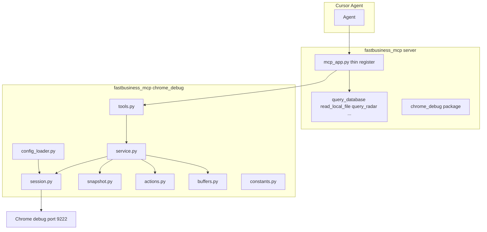
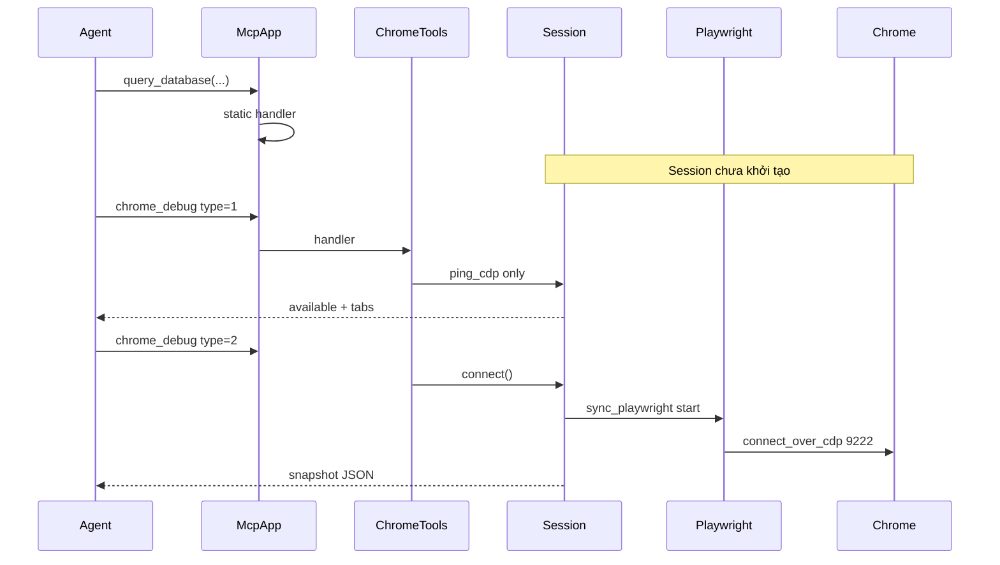

# 02 — Architecture Layers

## 1. Nguyên tắc thiết kế

1. **Tách package** — toàn bộ logic CDP nằm trong `fastbusiness_mcp/chrome_debug/`, không trộn vào `queryDatabase`, `xml_fbograph`, v.v.
2. **Thin register** — `mcp_app.py` chỉ import và đăng ký tool; không chứa Playwright/CDP.
3. **Lazy connect** — chỉ connect Chrome khi `chrome_debug` type ≥ 2; 5 tool static không load Playwright.
4. **Config riêng file** — `chrome_debug.yaml`, không nhét limit/CDP URL vào `config.yaml` chính.
5. **Optional dependency** — thiếu `playwright` → tool Chrome trả lỗi rõ; MCP static vẫn chạy.
6. **Service tách MCP** — `service.py` không import `MCPServer`; dễ unit test.

---

## 2. Sơ đồ tổng thể



---

## 3. Cấu trúc folder code (future)

```
fastbusiness_mcp/
├── mcp_app.py                 # import register_chrome_tools(server)
├── config.yaml                # optional: chrome_debug_config: chrome_debug.yaml
├── chrome_debug.yaml          # config riêng feature này
└── chrome_debug/
    ├── __init__.py            # export public API
    ├── constants.py           # default limits
    ├── config_loader.py       # load yaml + env merge
    ├── session.py             # CDP ping, Playwright connect, tab resolve
    ├── buffers.py             # TabBuffers, ring console/network
    ├── snapshot.py            # SNAPSHOT_JS, build_snapshot
    ├── actions.py             # click_target, fill_fields
    ├── service.py             # orchestration: list_tabs, inspect, capture...
    └── tools.py               # @server.tool chrome_debug + register_chrome_tools()
```

**Không** đặt file CDP trong `fastbusiness_mcp/tools/` (tránh lẫn `xml_snippet_tool.py`).

---

## 4. Trách nhiệm từng module

| Module | Trách nhiệm duy nhất | Không làm |
|--------|----------------------|-----------|
| `constants.py` | `MAX_SNAPSHOT_NODES`, `MAX_CONSOLE_LINES`, defaults | Đọc file yaml |
| `config_loader.py` | Resolve path, merge env, validate schema | Connect browser |
| `session.py` | `ping_cdp`, `connect_over_cdp`, `resolve_page`, hook events | Build snapshot JS |
| `buffers.py` | `TabBuffers` dataclass, deque maxlen | MCP tool decorator |
| `snapshot.py` | JS quét interactive, gắn `data-cdp-ref`, truncate label | Click/fill |
| `actions.py` | click + fill (`interact_page`), blur/Tab sau fill | Buffer console |
| `service.py` | Hàm nghiệp vụ trả dict/str JSON | Import MCPServer |
| `tools.py` | **Một** `@server.tool` `chrome_debug` — route theo `type` | Logic CDP sâu |

---

## 5. Lazy connect



- `ping_cdp`: HTTP GET `/json/version` — **không** cần Playwright.
- `connect`: chỉ khi tool cần tab thật (inspect, fill, capture sau hook).

---

## 6. Session & tab routing

**Singleton** `SESSION` (module-level):

- Giữ `_playwright`, `_browser`, `_buffers` per page id
- Thread lock (MCP stdio có thể sync tools)

**`resolve_page(tab_keyword)`:**

1. `all_pages()` từ `browser.contexts[].pages`
2. Nếu `tab_keyword` rỗng → tab cuối danh sách (heuristic active gần nhất)
3. Nếu có keyword → match substring `url` hoặc `title` (case-insensitive)
4. Không match → raise với danh sách tab hiện có

**Hook một lần per page:**

- `page.on("console")` → buffer
- `page.on("requestfailed")` → buffer
- `page.on("response")` status >= 400 → buffer (body truncated)

---

## 7. Snapshot — không raw HTML

DOM FBO có thể rất lớn (ExtJS, SVG, layout). `snapshot.py` chạy JS in-page:

- Chỉ phần tử **visible** + **interactive** (input, button, role, cursor:pointer, tabIndex)
- Loại svg/path
- Gắn `data-cdp-ref="e0"`… cho click ổn định trong phiên
- Giới hạn `max_nodes` từ config
- Cắt `label` theo `max_label_chars`

Output: JSON `{ tab_url, frames: [{ frame_index, elements: [...] }] }` — quét mọi frame (iframe FBO).

---

## 8. Playwright sync vs async

MCP tools hiện tại trong `mcp_app.py` dùng **sync** `def`. Package `chrome_debug` dùng **`playwright.sync_api`**.

**Lưu ý triển khai (event loop):** Nếu MCPServer chạy trên asyncio loop, gọi sync Playwright trực tiếp có thể lỗi *"Sync API inside asyncio loop"*. Giải pháp:

- Bọc mọi thao tác Playwright qua `ThreadPoolExecutor(max_workers=1)` / `asyncio.to_thread`, **hoặc**
- Dedicated worker thread khởi tạo `sync_playwright` một lần.
- Singleton session + `threading.Lock`.

Chi tiết: [../doc_fix/review_and_fix_recommendations.md](../doc_fix/review_and_fix_recommendations.md) §2.1.

---

## 9. Connection lifecycle

`session.py` — `resolve_page()`:

- Kiểm tra `browser.is_connected()` trước thao tác; stale → cleanup + reconnect.
- Bắt `TargetClosedError` → refresh tabs, gợi ý `chrome_debug(type=1)`.

---

## 10. Mở rộng sau MVP (plug-in points)

| Extension | File gắn |
|-----------|----------|
| `chrome_launch_debug` | `session.py` + config `launch.*` |
| `mode=fields_only` inspect | `snapshot.py` |
| FBO grid helper | `actions.py` hoặc `fbo_helpers.py` mới |
| iframe picker | `session.py` `resolve_frame()` |

Thêm file mới trong `chrome_debug/` — **không** sửa `queryDatabase/`.

---

## 11. Liên kết

- Config: [03_config.md](03_config.md)
- Tool spec: [04_tool_api.md](04_tool_api.md)
- Integration: [07_integration.md](07_integration.md)
