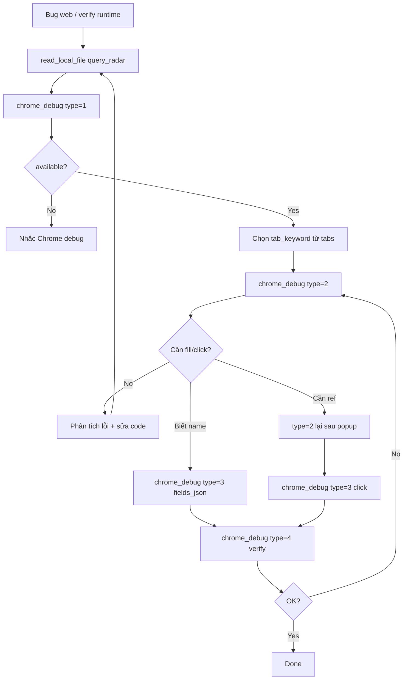

# 04 — Tool API Specification

## 1. Quy ước chung

| Quy ước | Giá trị |
|---------|---------|
| **Một tool duy nhất** | `chrome_debug` |
| Phân loại thao tác | `type`: `1` \| `2` \| `3` \| `4` (hoặc alias text — §2) |
| Transport | Cùng MCPServer `fastbusiness-mcp-server` |
| `tab_keyword` | `str = ""` — substring URL/title; rỗng = tab mặc định |
| Lỗi | Tiếng Việt, [tool_errors.py](../../fastbusiness_mcp/tool_errors.py) |
| Output | JSON string — **không** raw HTML |
| Dependency | `playwright` optional |

> **Thiết kế:** Thay vì 6–7 tool `chrome_*` riêng lẻ, agent chỉ nhớ **1 tool + type**. Logic nội bộ vẫn tách `service.py` / `actions.py` — không đổi kiến trúc package.

---

## 2. Bảng `type`

| type | Alias (optional) | Mục đích | Cần `tab_keyword`? |
|------|------------------|----------|-------------------|
| **1** | `status` | Ping CDP + liệt kê tab | Không |
| **2** | `inspect` | Lỗi console/network **+** snapshot UI (ref) | Có (trừ khi chỉ hook sau type 1) |
| **3** | `interact` | Fill field và/hoặc click | Có |
| **4** | `execute` | Chạy JS (grid ảo, verify readonly) | Có |

**Map cũ → mới (chỉ doc, không implement tool cũ):**

| Tool cũ (đã bỏ) | type |
|-----------------|------|
| `chrome_debug_status` + `chrome_list_tabs` | **1** |
| `chrome_capture_errors` + `chrome_inspect_page` | **2** |
| `chrome_interact_page` (click + fill) | **3** |
| `chrome_execute_js` | **4** |

---

## 3. Chữ ký MCP (Pydantic)

```python
@server.tool(name="chrome_debug")
def chrome_debug_tool(
    type: Annotated[int, Field(description="1=status, 2=inspect, 3=interact, 4=execute")],
    tab_keyword: Annotated[str, Field(default="")] = "",
    # type 2
    mode: Annotated[str, Field(default="interactive")] = "interactive",
    include_errors: Annotated[bool, Field(default=True)] = True,
    clear_errors: Annotated[bool, Field(default=False)] = False,
    # type 3
    click: Annotated[str, Field(default="")] = "",
    fields_json: Annotated[str, Field(default="")] = "",
    frame_index: Annotated[int, Field(default=0)] = 0,
    # type 4
    script: Annotated[str, Field(default="")] = "",
) -> str:
    ...
```

**Validation theo type:**

| type | Bắt buộc | Cấm / bỏ qua |
|------|----------|--------------|
| 1 | — | `click`, `fields_json`, `script` bỏ qua |
| 2 | — | `click`, `fields_json`, `script` bỏ qua |
| 3 | ít nhất một: `click` hoặc `fields_json` | `script` bỏ qua |
| 4 | `script` khác rỗng | `click`, `fields_json` bỏ qua |

Lỗi validation: tiếng Việt, vd *"type=3 cần click hoặc fields_json"*.

---

## 4. type = 1 — status

**Mục đích:** Kiểm tra Chrome debug port + trả danh sách tab (gộp status + list_tabs).

### Ví dụ gọi

```
chrome_debug(type=1)
```

### Output (JSON)

```json
{
  "type": 1,
  "available": true,
  "cdp_url": "http://localhost:9222",
  "browser": "Chrome/131.0.0.0",
  "hint": "",
  "count": 2,
  "tabs": [
    { "index": 0, "title": "FastBusiness - Hóa đơn", "url": "https://.../arcthd1.aspx" },
    { "index": 1, "title": "Chọn hóa đơn", "url": "https://..." }
  ]
}
```

Khi `available: false` → `tabs: []`, `hint` có shortcut Chrome debug.

**Implementation:** type 1 chỉ **ping HTTP** `/json/version`; `tabs` lấy qua CDP list khi `available=true` (có thể lazy connect nhẹ).

---

## 5. type = 2 — inspect

**Mục đích:** Đọc buffer lỗi **trước**, rồi snapshot phần tử tương tác (gộp capture + inspect).

### Ví dụ gọi

```
chrome_debug(type=2, tab_keyword="hóa đơn")
chrome_debug(type=2, tab_keyword="arcthd", include_errors=true)
```

### Output (JSON)

```json
{
  "type": 2,
  "tab_url": "https://.../arcthd1.aspx",
  "console": [
    { "type": "error", "text": "Uncaught TypeError: ...", "ts": 1710000000.1 }
  ],
  "network_errors": [
    {
      "url": "https://.../Save",
      "method": "POST",
      "status": 500,
      "request_payload": "{...}",
      "response_body": "...truncated..."
    }
  ],
  "errors_note": "",
  "frames": [
    {
      "frame_index": 0,
      "frame_url": "https://...",
      "node_count": 45,
      "elements": [
        {
          "ref": "e12",
          "tag": "input",
          "name": "ma_kh",
          "label": "Mã khách",
          "disabled": false
        },
        {
          "ref": "e17",
          "tag": "button",
          "label": "Lưu",
          "disabled": false
        }
      ]
    }
  ]
}
```

- `include_errors=false` → chỉ trả `frames` (future tối ưu token).
- Buffer rỗng + user vẫn báo lỗi → `errors_note` gợi ý reproduce (reload / thao tác lại).
- **Cấm** raw HTML; `max_nodes` từ config.

Agent dùng `ref` / `name` cho **type 3**.

---

## 6. type = 3 — interact

**Mục đích:** Fill master form và/hoặc click (gộp click + fill).

### Ví dụ gọi

```
chrome_debug(type=3, tab_keyword="SVTran", fields_json='{"ma_kh":"123"}')
chrome_debug(type=3, tab_keyword="Chọn hóa đơn", fields_json='{"ngay_ct1":"2025-01-01"}', click="Nhận", frame_index=1)
```

### Output (JSON)

```json
{
  "type": 3,
  "click": "Clicked ref=e17",
  "filled": [
    "ma_kh -> input[name=\"ma_kh\"]",
    "ngay_ct -> NOT FOUND"
  ]
}
```

**Thứ tự:** fill trước → click sau.

**FBO fill:** `.fill()` + blur/Tab; fallback label/placeholder.

**An toàn:** Agent **không** click `Xóa`, `Hủy`, `Delete`, `Lưu` trừ khi user yêu cầu.

---

## 7. type = 4 — execute

**Mục đích:** Escape hatch — grid ảo, `$find`, verify readonly.

### Ví dụ gọi

```
chrome_debug(type=4, tab_keyword="hóa đơn", script="(function(){ var el=document.querySelector('[name=ngay_ct]'); return { readonly: el && el.readOnly }; })()")
```

### Output (JSON)

```json
{
  "type": 4,
  "ok": true,
  "result": { "readonly": true }
}
```

Result cắt `max_result_chars`; **cấm** trả grid/HTML lớn.

---

## 8. Workflow agent (1 tool)



**Gợi nhớ nhanh:**

```
1 = sống không? + tab nào?
2 = lỗi gì + UI ref?
3 = bấm / điền
4 = JS / grid
```

---

## 9. Token budget (ước lượng)

| type | Output | Ghi chú |
|------|--------|---------|
| 1 | ~10–40 dòng | Ping + tabs |
| 2 | TB thấp | Cap nodes + truncate network body |
| 3 | Rất thấp | JSON click + filled[] |
| 4 | Thấp | Cap result |

Tối đa **3** lần gọi `chrome_debug` / vòng test / lượt agent (mọi type cộng dồn).

---

## 10. Liên kết

- Agent workflow: [05_agent_workflow.md](05_agent_workflow.md)
- Token: [06_token_budget.md](06_token_budget.md)
- Integration: [07_integration.md](07_integration.md)
- Góp ý triển khai: [../doc_fix/review_and_fix_recommendations.md](../doc_fix/review_and_fix_recommendations.md)
