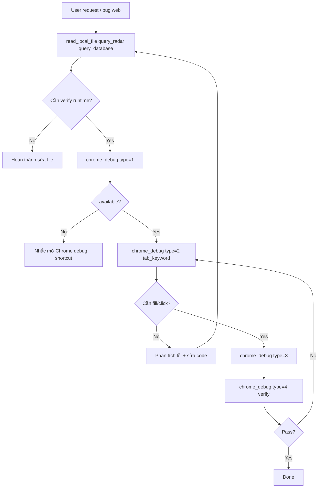

# 05 — Agent Workflow

## 1. Nguyên tắc

1. **Static trước, runtime sau** — `read_local_file(3)`, `query_radar`, `query_database` trước `chrome_debug`.
2. **Một tool Chrome** — `chrome_debug(type=1|2|3|4)`; không gọi tên tool cũ (`chrome_inspect_page`, …).
3. **Chrome không bắt buộc** — `type=1` → `available: false` → nhắc shortcut, không retry vô hạn.
4. **type=2 trước khi bấm** — user báo lỗi → `type=2` (đã gồm lỗi + snapshot); không dump HTML.
5. **Giới hạn vòng lặp** — tối đa **3** lần gọi `chrome_debug` / lượt (mọi type).
6. **An toàn dữ liệu** — `type=3`: không click `Xóa`/`Hủy`/`Lưu` trừ khi user yêu cầu; ưu tiên phiếu **New**.

### Bảng type (nhắc nhanh)

| type | Khi nào |
|------|---------|
| **1** | Đầu session: CDP sống? tab nào? |
| **2** | Lỗi console/network + cần ref nút/field |
| **3** | Fill `fields_json` và/hoặc `click` |
| **4** | Grid ảo, verify readonly qua JS |

---

## 2. Workflow chuẩn



---

## 3. Khi nào gọi / không gọi `chrome_debug`

### Gọi

- User báo lỗi **chạy** web (Save, grid, popup, console)
- Sau sửa JS/XML, user yêu cầu agent verify
- Cần payload/response API lỗi thật

### Không gọi

- Chỉ sửa proc/SQL/XML static
- Tra graph, entity, schema
- `type=1` → `available: false` và user không mở Chrome

---

## 4. Ví dụ end-to-end: `ma_kh = 123` → `ngay_ct` readonly (SVTran)

> FBO SP2263: [10_fbo_sp2263_runtime_profile.md](10_fbo_sp2263_runtime_profile.md).

### Phase A — Static

| Bước | Tool | Mục đích |
|------|------|----------|
| 1 | `query_radar` Template 1 | Tìm `SVTran.xml` |
| 2 | `read_local_file(..., 3)` | Summary fields, handlers |
| 3 | Edit XML | `onChange$Voucher$ma_kh` + readonly logic |

### Phase B — Runtime

| Bước | Gọi | Agent thấy |
|------|-----|------------|
| 5 | `chrome_debug(type=1)` | `available: true`, tab hóa đơn |
| 6 | `chrome_debug(type=2, tab_keyword="hóa đơn")` | Lỗi baseline + ref fields |
| 7 | `chrome_debug(type=3, fields_json='{"ma_kh":"123"}', tab_keyword="hóa đơn")` | UI đổi |
| 8 | `chrome_debug(type=4, script="...", tab_keyword="hóa đơn")` | Verify `ngay_ct` readonly |
| 9 | `chrome_debug(type=3, fields_json='{"ma_kh":"999"}')` | Case đảo |
| 10 | `chrome_debug(type=4, script="...")` | readonly = false |
| 11 | Fail? | `type=2` → sửa code, tối đa 3 vòng |

Script verify mẫu (`type=4`):

```javascript
(function(){
  var el = document.querySelector('[name=ngay_ct]');
  if (!el) return { found: false };
  return { found: true, readOnly: !!(el.readOnly || el.disabled) };
})()
```

---

## 5. Agent biết bấm nút nào?

| Nguồn | Cung cấp |
|-------|----------|
| `read_local_file(3)` | `ma_kh`, `ngay_ct`, handlers |
| `chrome_debug(type=2)` | `ref`, `label`, `name` |
| User intent | "Lưu", "điền ma_kh" |

Ưu tiên: **`name`** → **text** → **ref** → **`type=4`**.

---

## 6. Rule đề xuất append vào `.cursorrules`

```markdown
## Chrome Debug MCP (runtime) — 1 tool

Tool: `chrome_debug(type=1|2|3|4)`
- 1 = status + tabs
- 2 = errors + inspect snapshot
- 3 = interact (fields_json / click)
- 4 = execute_js

### Workflow
1. Static trước: read_local_file(3), query_radar, query_database.
2. type=1 — available=false → nhắc Chrome debug, không retry liên tục.
3. User báo lỗi: type=2 trước type=3.
4. type=3: ưu tiên fields_json theo name FBO; frame_index cho popup.
5. type=4: result JSON nhỏ; không trả grid/HTML.
6. Tối đa 3 lần chrome_debug / lượt.
7. Không click Xóa/Hủy/Lưu trừ khi user yêu cầu.
```

---

## 7. Retrieve / `showForm` / FlowMulti

1. Static: `Grid/*Detail.xml` → `show_forms`, `related_controllers`.
2. Runtime popup: `type=1` → chọn `tab_keyword` = `title_v` Filter → `type=2` → `type=3` tick/Nhận → `type=1` lại tab master → `type=4` verify grid.

Chi tiết: [11_fbo_showform_flowmulti_patterns.md](11_fbo_showform_flowmulti_patterns.md).

---

## 8. Tương tác trực quan trên Chrome

`type=3` — user **nhìn thấy** Chrome đổi. Tránh thao tác tay cùng tab lúc agent test.

`type=1`, `type=2` (chỉ đọc) — UI không đổi trừ khi buffer đã hook từ trước.

---

## 9. Báo cáo / danh mục — MainReport runtime

> Chi tiết API, ví dụ script, sai lầm thường gặp: **[12_fbo_webforms_mainreport_runtime.md](12_fbo_webforms_mainreport_runtime.md)**

### Báo cáo (filter → grid)

1. **Classify:** `MainReport._type === null` + `searchExtender._type === 'Report'` → đang ở phase filter.
2. Fill ngày qua **DOM** (`dd/MM/yyyy`); field lookup (**ma_vt**, …) → **bấm lookup**, chọn mã thật — **không gõ tay**.
3. **Nhận** → verify text điều kiện trên toolbar.
4. **Tìm** (`ToolbarButton_Search`) — bắt buộc; Nhận alone không chạy truy vấn.
5. Verify grid: `type=4` script loop `_getItemValue(row, col)` — row/col **1-based** (§7 file 12).

### Danh mục / browse grid

1. **Classify:** `MainReport._type === ''`.
2. Có thể cần bấm **Tìm** để load grid.
3. Đọc data: `_fields` + `_getItemValue(r, c)` — không scrape HTML.

### Chứng từ (MainReport browse)

1. **Classify:** `MainReport._type === 'Voucher'`.
2. **Mới** → `dirExtender` popup; fill qua `dirExtender_form_*`.
3. Lưu ý: `typeof f === 'undefined'` trên trang MainReport — dùng `$find`, không expect ExtJS `f`.

---

## 10. Liên kết

- Tool spec: [04_tool_api.md](04_tool_api.md)
- Token: [06_token_budget.md](06_token_budget.md)
- Dev test: [08_dev_test_guide.md](08_dev_test_guide.md)
- showForm: [11_fbo_showform_flowmulti_patterns.md](11_fbo_showform_flowmulti_patterns.md)
- MainReport runtime: [12_fbo_webforms_mainreport_runtime.md](12_fbo_webforms_mainreport_runtime.md)
- **Kiến trúc agent dynamic (Gemini):** [13_fbo_runtime_agent_architecture.md](13_fbo_runtime_agent_architecture.md)
