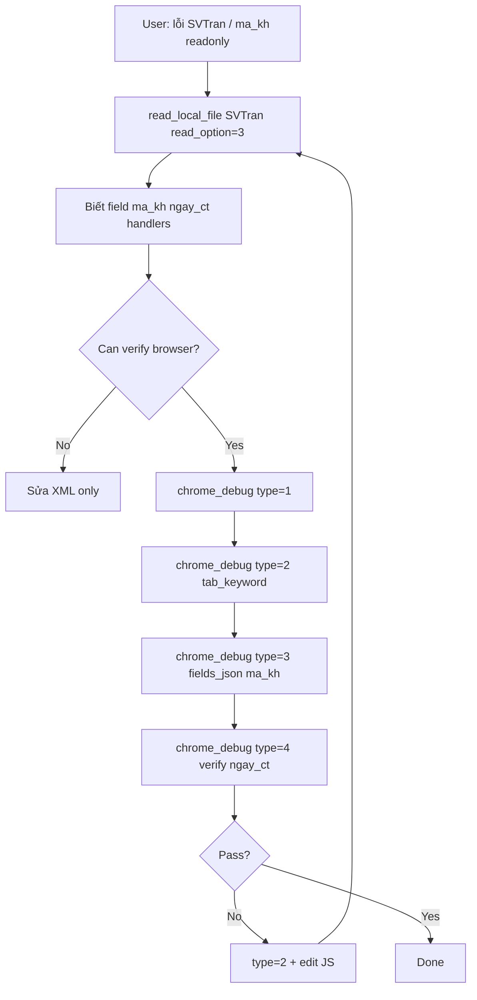

# 10 — FBO Runtime Profile: SP2263 (`App_Data\Controllers`)

Tài liệu bổ sung dựa trên review thực tế project **E:\FBO\SP2263\App_Data\Controllers** — giúp thiết kế Chrome CDP Debug MCP và rule Agent **sát FBO**, không generic.

> **Nguồn:** `read_local_file(read_option=3)`, grep XML/JS trên SP2263 (SVTran, SVDetail, WHTran, Lookup Customer). Không dump HTML runtime.

---

## 1. Quy mô Controllers SP2263

| Folder | Số file XML (ước lượng) | Vai trò runtime |
|--------|-------------------------|-----------------|
| **Dir** | ~105 | Form master chứng từ / danh mục (`*Tran.xml`, `dm*.xml`) |
| **Grid** | ~285 | Grid chi tiết embed + grid độc lập |
| **Filter** | ~268 | Màn browse / điều kiện lọc |
| **Lookup** | ~400 | Popup chọn danh mục |
| **Report** | ~686 | Báo cáo (ít dùng Chrome MCP) |

**Pattern master–detail chuẩn:**

```
Dir/SVTran.xml          → master (m81$), field embed grid: d81
Grid/SVDetail.xml       → logic + SQL grid chi tiết (d81$)
Lookup/Customer.xml     → popup chọn ma_kh
Filter/...              → mở list trước khi vào Tran
```

---

## 2. Web UI SP2263 — không map 1-1 tên XML

### 2.1 Trang ASP.NET

- UI chạy qua **`E:\FBO\SP2263\Main\*.aspx`** (WebForms), tên file **không** trùng controller XML.
- Ví dụ bán hàng / hóa đơn: `arcthd1.aspx`, `arcthd2.aspx`, … — không phải `SVTran.aspx`.
- Login: `Main/Login.aspx`.

### 2.2 `tab_keyword` gợi ý cho Agent

| Ưu tiên | Keyword | Ví dụ |
|---------|---------|--------|
| 1 | `title_v` từ summary | `hóa đơn`, `phiếu nhập` |
| 2 | Mã CT (`controller.id`) | `HDA` (SVTran), `PNH` (WHTran) |
| 3 | Tên aspx đang mở | `arcthd1` (user đang ở tab đó) |
| 4 | Field nghiệp vụ trên title bar | `so_ct`, text user nhìn thấy |

**Không** expect URL chứa `SVTran.xml` — Agent nên `chrome_debug(type=1)` rồi chọn title/URL khớp ngữ cảnh user mô tả.

---

## 3. Object model JavaScript FBO (master form)

### 3.1 Biến quen thuộc

| Symbol | Ý nghĩa | Ghi chú Chrome MCP |
|--------|---------|-------------------|
| `f` | Form master (Dir) | `f.getItemValue('ma_kh')`, `f.getItem('ngay_ct')` |
| `g` | Grid chi tiết embed | `g = f.getItem('d81')._controlBehavior` — **ảo**, khó fill DOM |
| `o` | Control gọi event (onChange) | `o.parentForm.request(...)` |
| `$find(id)` | Sys.Application find form | ID dynamic theo session |
| `$message.show` | Dialog cảnh báo | Có thể block flow sau click |

### 3.2 Naming handler (từ SVTran thực tế)

```
init$Voucher$
scatter$Voucher$
onChange$Voucher$Customer      → request Customer
onChange$Voucher$DebitAccount
on$Voucher$ExecuteCommand      → toolbar Save/Delete/...
on$Voucher$ResponseComplete    → sau request server
onRequest$Failed               → thường stub rỗng {}
close$Voucher$
```

**Implication:** Lỗi save thường lộ ở **network response** + `$message.show`, không phải `onRequest$Failed`.

### 3.3 Request master → server

Pattern lặp lại (SVTran):

```javascript
function onChange$Voucher$Customer(o) {
  o.parentForm.request('Customer', 'Customer', ['ma_kh'], o);
}
function on$Voucher$ResponseComplete(sender, e) {
  // xử lý result theo e.type.Action
}
```

**Actions thường gặp (SVTran):** `Customer`, `DebitAccount`, `GetTaxRate`, `GetExchangeRate`, `GetVoucherNumber`, `Reading`, `Transaction`, `TaxAccount`.

**Chrome `capture_errors` nên theo dõi:** POST/GET tới handler FBO sau khi đổi `ma_kh`, `ma_gd`, Save — status 4xx/5xx + response body (cắt ngắn).

---

## 4. Field master — map XML ↔ DOM

### 4.1 Quy ước tên (SP2263)

| Pattern | Ví dụ | Ghi chú |
|---------|--------|---------|
| Khóa | `stt_rec` | hidden |
| Mã | `ma_kh`, `ma_gd`, `ma_nt` | fill được qua `name` |
| Tên hiển thị | `ten_kh%l`, `ten_tk%l` | `readOnly`, **external** — không fill |
| Ngày | `ngay_ct`, `ngay_lct` | type DateTime |
| Tổng cộng | `t_tt`, `t_so_luong` | thường `disabled="true"` |
| Embed grid | `d81`, `d34` | field name = alias grid |

### 4.2 Readonly / disabled trong XML

SVTran ví dụ:

```xml
<field name="ten_kh%l" readOnly="true" external="true" .../>
<field name="t_tt_nt" disabled="true" .../>
<field name="ngay_ct" ... readOnly="true" inactivate="true"/>  <!-- một số CT -->
```

Runtime lock thêm bằng JS:

```javascript
f.getItem(a[i]).disabled = !v;
// hoặc setItemReadOnly trong custom onChange
```

**Verify readonly:** DOM `readOnly`/`disabled` **có thể không đủ** — dùng `chrome_debug(type=4, script=...)`:

```javascript
(function(){
  var f = $find('FORM_CLIENT_ID'); // thường cần đọc từ f.get_id() trong context
  // Thực tế SP2263: thử DOM trước
  var el = document.querySelector('[name=ngay_ct]');
  return {
    dom_readOnly: el && el.readOnly,
    dom_disabled: el && el.disabled
  };
})()
```

Hoặc sau khi Agent đọc XML biết handler → trigger `onChange$Voucher$Customer` bằng fill `ma_kh` rồi quan sát `ngay_ct`.

### 4.3 Field hay test (master)

| Chứng từ | Field test | onChange |
|----------|------------|----------|
| SVTran | `ma_kh`, `ngay_ct`, `ma_gd`, `so_ct` | `onChange$Voucher$Customer` |
| WHTran | `ma_kh`, `ngay_ct`, `ma_gd`, `d34` | tương tự |
| Grid alias | `d81` (SV), `d34` (WH) | embed — không fill trực tiếp |

---

## 5. Grid chi tiết — thách thức lớn nhất

### 5.1 SVDetail (`Grid/SVDetail.xml`)

- **82 fields**, grid ảo: `ma_vt`, `so_luong`, `gia_nt2`, …
- Handler: `onChange$GridVoucherDetail$Item`, `on$GridVoucherDetail$ResponseComplete`
- Gọi: `o.grid.request`, `f.executeExpression`
- **Formula GA** trong summary (`grid_formulas`) — tính `tien_nt2`, `thue_nt` tự động

### 5.2 Chrome MCP trên grid

| type | Master form | Grid chi tiết |
|------|-------------|---------------|
| **3** interact | OK (`ma_kh`, …) qua `fields_json` | **Kém** — dùng **4** execute |
| **2** inspect | OK nút + input | **Thiếu** cell ảo |
| **4** execute | Verify | **Bắt buộc** — API `_controlBehavior` |
| **2** (errors) | OK | OK (request Item/UOM/Site…) |

**Phase 3 doc:** `fbo_helpers.py` — wrapper `_getColumnOrder`, set cell value (chỉ spec, chưa code).

### 5.3 FlowMulti / showForm (SVDetail summary)

`show_forms` liên quan: `SVInvoiceFilter`, `SVOrderMultiGrid`, … — mở **popup/frame mới**.

Agent workflow:

1. `chrome_debug(type=1)` chọn tab; `type=2` trên **frame_index > 0** khi popup
2. Sau `showForm` → **type=2 lại** (ref cũ hết hạn)

**Chi tiết đầy đủ** (7 kiểu showForm, Retrieve chain, bảng Detail→Filter, FlowMulti): [11_fbo_showform_flowmulti_patterns.md](11_fbo_showform_flowmulti_patterns.md).

---

## 6. Lookup popup

`Lookup/Customer.xml` — bảng `zvdmkhLookup`, cột `ma_kh`, `ten_kh%l`.

- Mở khi focus field có `lookup="Customer"` + F3/browse
- DOM thường là **cửa sổ con** hoặc overlay grid
- `chrome_debug(type=3, click=...)` text **Mã khách** / row lookup — snapshot sau popup (`type=2`)
- **Không** fill `ten_kh%l` (readonly external)

---

## 7. Network & lỗi đặc thù FBO

### 7.1 Nên bắt

- Response **4xx/5xx** sau Save / Insert / Update
- Request **`Reading`**, **`Customer`**, **`GetVoucherNumber`** fail
- Console **`$message.show`** không lộ stack — dựa network body

### 7.2 Proc hay gọi (SVTran SQL summary)

`FastBusiness$App$Voucher$UpdateGeneral`, `fs_PostSVTran`, `FastBusiness$Voucher$Posting$Inventory`, …

Agent thấy API lỗi → `query_database` tra proc liên quan (static MCP).

### 7.3 Partition

Bảng `d81$$partition$current`, `m81$` — **không** hardcode partition trong test script; dùng phiên login thật.

---

## 8. Workflow Agent đề xuất (SP2263)



### Ví dụ cụ thể SP2263: `ma_kh = 123` → `ngay_ct` readonly

1. **Static:** `read_local_file(Dir/SVTran.xml, 3)` → thấy `ma_kh`, `ngay_ct`, `onChange$Voucher$Customer`
2. Sửa thêm handler hoặc `onChange$Voucher$Customer` custom + `setItemReadOnly('ngay_ct', ...)`
3. **Runtime:** tab keyword `hóa đơn` hoặc `arcthd`
4. `chrome_debug(type=3, fields_json='{"ma_kh":"123"}')` — trigger request Customer
5. `chrome_debug(type=4, script=...)` — kiểm tra `[name=ngay_ct]`
6. `chrome_debug(type=3, fields_json='{"ma_kh":"999"}')` — case đảo

---

## 9. Token — field whitelist SP2263

`inspect` mode **`fields_only`** (future) nên ưu tiên tên từ summary:

**Master thường gặp:** `ma_kh`, `ngay_ct`, `ngay_lct`, `so_ct`, `ma_gd`, `dien_giai`, `ma_nt`, `ty_gia`, `status`

**Bỏ qua snapshot:** `ten_*%l`, `t_tien*`, `t_tt*` (disabled aggregate), hidden `stt_rec`, `cookie`

→ Giảm ~40% node so với scan full interactive.

---

## 10. Giới hạn đã biết (SP2263)

| Tình huống | Hành vi |
|------------|---------|
| Grid cell `ma_vt` | Cần JS grid API, không fill DOM |
| Lookup Customer popup | Frame/popup riêng, inspect lại |
| Toolbar icon không chữ | Dùng `aria-label` hoặc ExecuteCommand qua JS |
| `onRequest$Failed` rỗng | Dựa `capture_errors` |
| Encrypted XML blocks | 13 block encrypted SVTran — không đọc raw, dùng summary |
| Nhiều tab FBO | `tab_keyword` bắt buộc |

---

## 11. Checklist trước khi test Chrome trên SP2263

- [ ] Chrome debug profile riêng, đã login `Main/Login.aspx`
- [ ] Mở đúng chứng từ (vd hóa đơn bán hàng)
- [ ] `reference_file` absolute khi gọi static MCP: `E:\FBO\SP2263\App_Data\Controllers\Dir\SVTran.xml`
- [ ] Agent đã `read_local_file(3)` biết field names trước `fill_form`
- [ ] Test grid: plan `execute_js`, không expect `fill_form` cho `ma_vt`

---

## 12. Liên kết

- Tool API chung: [04_tool_api.md](04_tool_api.md)
- Agent workflow: [05_agent_workflow.md](05_agent_workflow.md)
- Token: [06_token_budget.md](06_token_budget.md)
- Implementation: [09_implementation_checklist.md](09_implementation_checklist.md)
