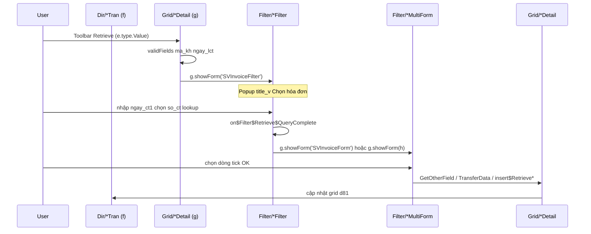
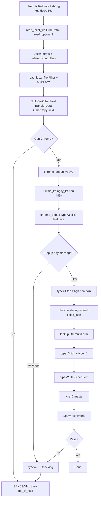

# 11 — FBO `showForm` / FlowMulti / FlowForm (SP2263)

Tài liệu bổ sung cho [10_fbo_sp2263_runtime_profile.md](10_fbo_sp2263_runtime_profile.md): phân loại **mọi kiểu mở form/popup** qua `g.showForm`, `f.grid.showForm`, `show$FlowMulti$Form`, `show$Form` — kết hợp review SP2263 Controllers và skill **fbo_js_skill** (FlowMulti, request-deferred, `$message`).

> **Nguồn Controllers:** `read_local_file(read_option=3)`, grep `showForm(` trên Grid/Filter/Dir, Include `FlowFilterFunction.txt`, `FlowMultiScript.txt` (encrypted), `StandardListScript.txt`.  
> **Nguồn skill:** `~/.cursor/skills/fbo_js_skill/` — `js-flow-multi.md`, `js-request-deferred.md`, `js-request.md`, `examples-flow-multi-fa.md`, `warnings.md`.

---

## 1. Tại sao Agent cần nắm `showForm`

Mỗi lần `showForm(...)` runtime FBO thường:

1. Mở **popup / layer / iframe mới** (không còn cùng DOM context với form master).
2. Đổi **title tab/window** (vd `Chọn hóa đơn`, `Thông tin phiếu`).
3. Làm **ref snapshot Chrome cũ hết hạn** — Agent phải `chrome_debug(type=1)` chọn tab + `type=2` lại.
4. Thường đi kèm **request async** (Check → rồi mới `showForm`) hoặc **FlowMulti Nhận** (`GetOtherField` → `TransferData` → `cancelDialog`).

Agent **static-first**: đọc summary XML (`show_forms`, `related_controllers`, `title_v`) **trước** khi click Retrieve trên browser. Khi sửa JS popup/transfer → ưu tiên skill `fbo_js_skill`, không đoán từ DOM.

---

## 2. Taxonomy — 8 kiểu gọi mở form

| # | Kiểu | API / hàm | Gọi từ | Mục đích |
|---|------|-----------|--------|----------|
| **A** | Retrieve Detail → Filter | `g.showForm('SVInvoiceFilter')` | `on$GridVoucherDetail$ExecuteCommand`, case `'Retrieve'` | Chọn nguồn CT để kéo dòng vào grid chi tiết |
| **B** | Filter → bước tiếp | `g.showForm(h)` / `g.showForm('SVInvoiceForm')` | `show$*Filter$QueryComplete` | Sau lookup `so_ct` hoặc chọn multi → mở Form trung gian |
| **C** | FlowMulti | `show$FlowMulti$Form(f, queryString, ...)` | `Filter/*MultiForm.xml` | Popup chọn **nhiều dòng** nguồn, copy về Detail |
| **D** | Browse grid + quyền | `show$Form(g, c)` → `g.showForm(c)` | Grid browse (`*Tran.xml`, danh mục) | Toolbar Import / APV / FlowMulti từ list |
| **E** | FlowForm | `g.showForm('CreatePOFromPRForm')` | Grid browse custom (`zcprtopo.xml`) | Tạo CT đích từ CT nguồn đã chọn |
| **F** | Dir embed grid | `f.grid.showForm('fsdGallerManager')` | `Dir/Customer.xml` init | Popup phụ gắn master form (gallery, …) |
| **G** | Include / entity | `g.showForm('APVHistoryDetail')` | `APVHistoryResponse.txt`, `ImportXmlScript.txt` | Logic dùng chung, không nằm trực tiếp trong file Grid |
| **H** | Request trước → showForm | `f.request` / `g.request` → ResponseComplete → `showForm` | Toolbar / menu / onChange | Check DB (quyền, trạng thái) **rồi mới** mở popup |

**Quy ước biến:**

| Symbol | Ý nghĩa |
|--------|---------|
| `g` | Grid behavior — thường `f.getItem('d81')._controlBehavior` (Detail) hoặc grid browse độc lập |
| `f` | Form master Dir hoặc form Filter / MultiForm popup |
| `h` | Tên controller đích **động** (truyền từ server sau Retrieve query) |
| `c` | Tên controller đích **tĩnh** (string literal) |
| `w` / `document.body._form` | Phiếu cha khi đứng trong MultiForm (FlowMulti) |
| `z` | Grid đích trên phiếu cha (`w.getItem('d81')._controlBehavior`) |

---

## 3. Quy ước đặt tên controller (cụm Retrieve)

Một luồng Retrieve điển hình gồm **4–6 file** cùng prefix:

```
{Prefix}Filter.xml       → popup điều kiện + lookup so_ct (title_v: "Chọn …")
{Prefix}Form.xml         → form 1 dòng / xác nhận (ít field)
{Prefix}MultiForm.xml    → popup chọn nhiều dòng (FlowMulti)
{Prefix}MultiGrid.xml    → grid bên trong MultiForm
{Prefix}Grid.xml         → grid nguồn (optional)
{Prefix}Lookup.xml       → lookup so_ct trên Filter
```

**Ví dụ SV (bán hàng / HDA):**

| File | title_v | Vai trò |
|------|---------|---------|
| `Filter/SVInvoiceFilter.xml` | Chọn hóa đơn | Bước 1 — nhập ngày + chọn HĐ |
| `Filter/SVInvoiceForm.xml` | (form trung gian) | Bước 2 — nếu không redirect `h` |
| `Filter/SVInvoiceMultiForm.xml` | Chọn hóa đơn | Bước 3 — chọn nhiều dòng copy |
| `Grid/SVInvoiceMultiGrid.xml` | — | Grid trong MultiForm |

Summary `Grid/SVDetail.xml` liệt kê đủ cụm:

- `show_forms`: `SVInvoiceFilter`, `SVIssueFilter`, `SVOrderFilter`, `ViewReceiptFilter`
- `related_controllers`: thêm `*Form`, `*MultiForm`, `*MultiGrid`, `*Lookup`, `*Grid`

**Ví dụ CP (phiếu chi / BN1):** `Grid/CPDetail.xml` → `CPInvoiceFilter` / `CPRequestFilter` → `CPInvoiceMultiForm` / `CPRequestMultiForm`.  
> **Lưu ý SP2263:** `CPInvoiceFilter.xml`, `CPRequestFilter.xml` **không** có file riêng trong folder Filter của project custom — có thể kế thừa từ sản phẩm gốc hoặc entity. Agent vẫn tra được tên qua summary `CPDetail` và grep `showForm('CP`.

---

## 4. Pattern A — Retrieve từ Grid chi tiết (Detail)

### 4.1 Trigger

Toolbar grid chi tiết, command `'Retrieve'`, trong `on$GridVoucherDetail$ExecuteCommand`.

**Điều kiện chung trước khi mở Filter:**

- `f._action != 'View'`
- `f.validFields(...)` — thường `ma_kh`, `ngay_lct` hoặc `ngay_ct`, `loai_ct`
- `switch (e.type.Value)` — giá trị toolbar con (0, 10, 20, 30, 40…)

### 4.2 SVDetail — hóa đơn bán (HDA)

File: `Grid/SVDetail.xml`

| `e.type.Value` | Điều kiện thêm | Filter mở |
|----------------|----------------|-----------|
| `'0'`, `'10'` | — | `SVOrderFilter` |
| `'30'` | `loai_ct != '2'` | `SVIssueFilter` |
| `'40'` | `loai_ct == '4'` | `SVInvoiceFilter` |

Case khác: command không phải Retrieve — mở `ViewReceiptFilter` khi dòng có `px_gia_dd` và valid `ngay_lct`.

### 4.3 CPDetail — giấy báo nợ / phiếu chi (BN1)

File: `Grid/CPDetail.xml`

| `e.type.Value` | Điều kiện | Filter |
|----------------|-----------|--------|
| `'10'` | `loai_ct == '1'` | `CPInvoiceFilter` |
| `'20'` | — | `CPRequestFilter` |

Chặn Retrieve khi `loai_ct == '3'` hoặc `f._action == 'View'`.

### 4.4 Các Detail khác (SP2263)

| Detail | Filter / Form mở | Ghi chú |
|--------|------------------|---------|
| `CRDetail` | `CRInvoiceFilter`, `CRRequestFilter`, `zcldlCRTranFilter` | Giống CP |
| `CDDetail`, `CBDetail` | `CDInvoiceFilter`, `CDRequestFilter`, … | Cùng pattern |
| `PVDetail` | `PVOrderFilter`, `PVReceiptFilter`, `PVIRFilter` | Theo `loai_ct` / flag |
| `PDDetail` | `zcPDDomesticFilter`, `PDImportFilter` | Custom SP2263 |
| `IRDetail` | `IRPhysicalFilter`, `IRReceiptFilter` | |
| `ISDetail` | `ViewReceiptFilter`, `ISMRFilter`, `ISPhysicalFilter` | |
| `PODetail` | `POBlanketFilter`, `PORequisitionFilter`, `POAllocatedFilter` | Mua hàng |
| `MRDetail` | `MRMOFilter`, `MRMenuForm`, import/paste forms | |
| `PRDetail` | `PRDetailImport`, `zcupdelidateForm` | |

### 4.5 Sơ đồ Retrieve (Detail → Filter → Multi → Detail)



---

## 5. Pattern B — Filter → Form (`FlowFilterFunction`)

Include chuẩn: `Include/Javascript/FlowFilterFunction.txt` (entity `&Identity;` thay prefix).

**Chuỗi hàm:**

```
on${Identity}Filter$Retrieve$QueryComplete(f, c, d, k, e, h, l)
  → set g._voucher$Retrieve$*, g._filter$Fields
  → set${Identity}Filter$FormScript(g, h)
       g._formScript = 'show${Identity}Filter$QueryComplete(this,\'' + h + '\')'
  → (defer) show${Identity}Filter$QueryComplete(g, h)
       if (h != '') g.showForm(h);
       else           g.showForm('{Identity}Form');
```

**Ví dụ thực tế:** `Filter/SVInvoiceFilter.xml`

- `title_v`: **Chọn hóa đơn**
- Field Filter: `ngay_ct1`, `so_ct` (lookup `SVInvoiceLookup`), hidden `ma_kh`, `ma_dvcs`
- `show_forms` summary → `SVInvoiceForm`
- Sau query lookup: mở `SVInvoiceForm` hoặc controller tên `h` do server trả về

**Filter custom cùng pattern:** `zcPDDomesticFilter.xml`, `zcldlCRTranFilter.xml`, `InputInvoiceRetrieveFilter.xml`.

**Chrome MCP:**

- Tab/popup mới title = `title_v` Filter (**Chọn hóa đơn**, **Chọn phiếu nhập**, …)
- Field fill Filter: **`chrome_debug(type=3, fields_json=...)`** (`ngay_ct1`, `so_ct`)

---

## 6. Pattern C — FlowMulti (`*MultiForm` + `*MultiGrid`)

> Chi tiết JS/SQL đầy đủ: skill `fbo_js_skill` → [js-flow-multi.md](file:///C:/Users/nguye/.cursor/skills/fbo_js_skill/js-flow-multi.md), mẫu FA → [examples-flow-multi-fa.md](file:///C:/Users/nguye/.cursor/skills/fbo_js_skill/examples-flow-multi-fa.md).

### 6.1 Entity & file bắt buộc

| File | Vai trò |
|------|---------|
| `Filter\{Name}MultiForm.xml` | Form popup (Dir), script transfer, action `GetOtherField` |
| `Grid\{Name}MultiGrid.xml` | Grid inquiry — tick `chon`, cột `sl_ss0` (SL nhận) khi có |
| `Dir\{Parent}Tran.xml` | Phiếu cha — `document.body._form = f` trong `active$Voucher$` |

Entity chuẩn trong `*MultiForm.xml`:

```xml
<!ENTITY Identity "SVInvoiceMultiForm">
<!ENTITY ParentController "SVTran">
<!ENTITY GridController "SVInvoiceMultiGrid">
<!ENTITY % FlowMultiVoucher SYSTEM "..\Include\FlowMultiVoucher.ent">
%FlowMultiVoucher;
<!ENTITY OtherCopyField "nhieu_dvt, he_so, ma_vi_tri, ...">
```

`OtherCopyField` = cột SQL trả thêm (ngoài grid tag row) — đăng ký virtual column cho `getColumnOrderTagRow`. Cột mới thêm **cuối list** (tránh lệch index).

### 6.2 Entry — `show$Identity$` → `show$FlowMulti$Form`

File `Filter/SVInvoiceMultiForm.xml` (SP2263):

```javascript
function show$SVInvoiceMultiForm$(f) {
  var z = f.grid, h = z.get_element().parentForm, queryFilterString = '', c = String.fromCharCode(253);
  queryFilterString = h.getItemValue('ma_dvcs');
  queryFilterString += c + h.getItemValue('ma_kh');
  queryFilterString += c + z._filter$Fields[0];
  // + ngay_ct + stt_rec nguồn ...
  show$FlowMulti$Form(f, queryFilterString,
    'SVInvoiceMultiFormDataGridPanel',
    'SVTran', 'SVInvoiceMultiGrid',
    'nhieu_dvt, he_so, ...');
}
```

Logic core `FlowMultiScript` thường **encrypted** — Agent dựa skeleton trong `*MultiForm.xml` + skill, không cố đọc Include encrypted.

### 6.3 Luồng Nhận (Checking → GetOtherField → TransferData)

```
User tick dòng + (tuỳ) sl_ss0 → Nhận
  → Checking (XML MultiForm): validate → f._checked = false nếu lỗi
  → on$Identity$Form$ResponseComplete case 'Checking'
       build f._$k = stt_rec + char(255) + stt_rec0 (chuỗi #tagrow)
       nếu rỗng → show$FlowMulti$RetrieveGrid
       else → f.request('GetOtherField', 'GetOtherField', [['k', 'Infinite', f._$k]])
  → SQL: &FlowMultiTagRowRequest; → #tagrow → SELECT OtherCopyField
  → case 'GetOtherField':
       a[i] = g._$k[i].concat(result[i].slice(2))  // bỏ array$, id
       on$Identity$TransferData(f, g, a)
  → TransferData:
       w = document.body._form          // phiếu cha
       z = w.getItem('d81')._controlBehavior
       insert$RetrieveTagRow$Items(...) hoặc insert$Retrieve$Items
       executeExpression / setItemValue master
       f.cancelDialog()                 // luôn cuối
```

**Quan trọng (skill):** Form popup lấy phiếu cha qua `document.body._form` — không dùng `f` của MultiForm để ghi grid Detail.

### 6.4 API Transfer — Agent cần biết khi verify

| API | Dùng khi |
|-----|----------|
| `insert$RetrieveTagRow$Items(g, a, r, z, row, fields, f1, f2)` | Copy cột từ array `a` → grid đích; `f1`→`f2` map tên khác (`stt_rec`→`stt_rec_hda`) |
| `getColumnOrderTagRow(g, 'sl_ss0')` | Index cột trên **array `a`** (tag + OtherCopyField) |
| `z._getColumnOrder('ma_vt')` | Index cột trên **grid đích** `z` |
| `DeleteData$Detail(w, 'd81')` | Mode **Replace** grid trước fill |
| `f.cancelDialog()` | Đóng popup — **luôn cuối** TransferData |

Append vs replace:

| Mode | Cách làm |
|------|----------|
| **Append** (phổ biến) | Không xóa grid; `_appendRow` từng dòng tick |
| **Replace** | `DeleteData$Detail` đầu `TransferData` |
| **Skip trùng** | Helper check tồn tại trước append |

Nhiều loại dòng từ 1 lần Nhận (`id_get_data` + UNION): xem skill `examples-flow-multi-fa.md` — tách `TransferData` / `TransferAttached`, gọi Attached **trước** `cancelDialog`.

### 6.5 So sánh FlowMulti vs `f.request` fill grid

| | `f.request` master → grid | FlowMulti |
|--|---------------------------|-----------|
| Trigger | onChange field | Nút Retrieve / Filter → MultiForm |
| Chọn nguồn | 1 key | Nhiều dòng tick + `sl_ss0` |
| Handler | `on$Voucher$ResponseComplete` | `on$Identity$Form$ResponseComplete` |
| Form đích | `f` (cùng form) | `document.body._form` (phiếu cha) |
| Fill | `setItemGridBehavior` / JSON | `insert$RetrieveTagRow$Items` |

### 6.6 Cụm MultiForm trên SP2263

| MultiForm | Parent | MultiGrid |
|-----------|--------|-----------|
| `SVInvoiceMultiForm` | `SVTran` | `SVInvoiceMultiGrid` |
| `SVOrderMultiForm` | `SVTran` | `SVOrderMultiGrid` |
| `SVIssueMultiForm` | `SVTran` | `SVIssueMultiGrid` |
| `ViewReceiptMultiForm` | … | `ViewReceiptMultiGrid` |
| `zcPDDomesticMultiForm` | `PDTran` | `zcPDDomesticMultiGrid` |
| `CPInvoiceMultiForm` | `CPTran` | `CPInvoiceMultiGrid` (summary CPDetail) |
| `PVOrderMultiForm`, … | `PVTran` | tương ứng |

### 6.7 Chrome MCP trên FlowMulti

| Bước | Tool | Ghi chú |
|------|------|---------|
| Mở MultiForm | `type=1` chọn tab | Title `title_v` MultiForm |
| Tick / Nhận | `type=3` click / `type=4` | Grid **ảo** |
| Network | `type=2` | `GetOtherField` 4xx/5xx |
| Sau transfer | `type=1` + `type=2` master | Popup đóng |
| Verify Detail | `execute_js` trên `f` / `document.body._form` | Đếm `_rowCount`, field link `stt_rec_*`, `*_so` |

**Verify gợi ý (sau Nhận):**

```javascript
(function () {
  var f = document.body._form; // hoặc $find form master
  var z = f.getItem('d81')._controlBehavior;
  return {
    rows: z._rowCount,
    action: f._action
  };
})()
```

---

## 7. Pattern H — Request trước, rồi mới `showForm`

> Skill: [js-request-deferred.md](file:///C:/Users/nguye/.cursor/skills/fbo_js_skill/js-request-deferred.md), [js-request.md](file:///C:/Users/nguye/.cursor/skills/fbo_js_skill/js-request.md).

Nhiều nút **không** gọi `showForm` đồng bộ trong `ExecuteCommand`. Pattern:

```
1. UI (toolbar / onChange)
     → gom g._$params, g._$pendingContext = 'ShowXxx'
     → e.type.cancelEvent = true   // menu async
     → g.request / f.request('ActionPhụ', ...)

2. <action id="ActionPhụ"> SQL → value / json

3. ResponseComplete case 'ActionPhụ'
     → FAIL: $message.show + return
     → OK: g.showForm('...') / show$Form(g, c) / chain request tiếp
```

**Implication Chrome:**

| Hiện tượng | Ý nghĩa |
|------------|---------|
| Click nút → **chưa** có popup ngay | Đang chờ `ActionPhụ` — `capture_errors` / network |
| `$message.show` rồi dừng | Check FAIL — đọc message, **không** expect Filter mở |
| Popup mở sau deferred | Chờ ResponseComplete → `type=1` + `type=2` |

**Không làm (agent sửa code):** gọi thẳng `showForm` trong bước 1 khi đã có check DB; cache quyền/status trong `Loading` khi cần realtime.

Ví dụ skill: Check quyền → Confirm; Check trạng thái HĐ → load data / mở form tạo CT.

---

## 8. Pattern D — `show$Form(g, c)` trên Grid browse

Grid danh sách chứng từ / danh mục khai báo wrapper **kiểm tra quyền** trước `showForm`:

```javascript
function show$Form(g, c) {
  (g._authorize == 1) && (!g._denyNew)
    ? g.showForm(c)
    : $message.show(g._denyMessage ? g._denyMessage : $df.getResources(g._language, "Message.NotAccess"));
}
```

**Biến thể:**

| File | Khác biệt |
|------|-----------|
| `Grid/CPTran.xml`, `PVTran.xml`, `SVTran.xml`, `GLTran.xml` | `!g._denyNew` |
| `Grid/MRTran.xml`, `Customer.xml`, `Job.xml` | Chỉ `_authorize == 1` |
| `Grid/InputInvoice.xml` | Thêm `show$FormDeny` |
| `Include/StandardListScript.txt` | Template copy cho danh mục |

**Gọi từ ExecuteCommand:**

```javascript
case 'ImportData':
  show$Form(g, 'CustomerImport');
  break;
```

**show_forms trên browse grid (ví dụ CPTran):** `APVHistoryDetail`, `CPMasterImport`.

Grid browse thường include `&FlowMultiScript;` — hỗ trợ FlowMulti từ list (encrypted).

**Chrome:** nếu click toolbar mà không mở form → snapshot có thể thấy dialog `$message` “không có quyền” — không phải lỗi CDP.

---

## 9. Pattern E — FlowForm (tạo CT từ CT)

Không qua Retrieve Detail — mở form **tạo mới** từ grid browse đã chọn dòng.

**Ví dụ:** `Grid/zcprtopo.xml`

```javascript
function request$Authorize(g, c) {
  if (isCheck$Grid(g))
    g.showForm('CreatePOFromPRForm');
}
```

File form: `Filter/CreatePOFromPRForm.xml`

- Entity: `FlowFormCommand`, `ScriptFlowFormFunction`
- Embed grid: `CreatePOFromPRGrid` qua field `d94`
- `title_v`: **Thông tin phiếu**

Tương tự: `CreatePOFromMRForm` ← `Grid/zcrpnc.xml`.

**Chrome MCP:** popup title **Thông tin phiếu**; grid `d94` trong form — cần `execute_js` nếu sửa dòng. Có thể kết hợp Pattern H (check trước khi `showForm`).

---

## 10. Pattern F — `f.grid.showForm` từ Dir master

Dir có thể gọi popup qua grid embed **không** phải Detail chứng từ:

**Dir/Customer.xml** — gallery ảnh:

```javascript
$get('fsd_btn_gallery').onclick = function () {
  f.grid._fieldList = f.getItem('list_img');
  f.grid._action = f._action;
  f.grid.showForm('fsdGallerManager');
}
```

**Grid/Customer.xml** — từ browse list:

```javascript
function viewGallery(o) {
  var g = $find('ctl00_FastBusiness_MainReport');
  g._fieldList = o.parentElement;
  g._action = 'view';
  g.showForm('fsdGallerManager');
}
```

**Khác biệt:** `f.grid` trên Dir thường là grid phụ (list ảnh, attachment), **không** phải `d81` Detail.

---

## 11. Pattern G — Include / gián tiếp

| Include | showForm target | Khi nào |
|---------|-----------------|---------|
| `APVHistoryResponse.txt` | `APVHistoryDetail` | Xem lịch sử duyệt từ browse |
| `ImportXmlScript.txt` | `InputInvoiceRetrieveFilter`, `*ImportForm` | HDDV / import XML |
| `FlowFilterFunction.txt` | `{Identity}Form` | Mọi Filter Retrieve chuẩn |
| `AutoLotSet.txt` | `{AutoLotForm}` | Grid WQDetail — tạo lô tự động |
| `PlanRetrieve.txt` | `PRSaleOrderFilter` | Kế hoạch / PR |
| `GraphReportInit.txt` | `{Identification}Graph` | Báo cáo graph từ form |
| `FilterFormModeScript.txt` | `ImportModeErrorDetail` | Lỗi import mode |

Agent grep `showForm` trong **Include** khi summary Grid có `calls: ["g.showForm"]` nhưng không thấy literal trong file Grid.

---

## 12. `$message.show` vs popup `showForm`

> Skill: [warnings.md](file:///C:/Users/nguye/.cursor/skills/fbo_js_skill/warnings.md) — **không** dùng `alert()`.

| Loại | API | Chrome thấy gì |
|------|-----|----------------|
| Chặn thao tác / không quyền | `$message.show(msg, focusScript)` | Dialog overlay — **không** mở Filter/MultiForm |
| Checking MultiForm fail | `$message.show` + `f._checked = false` | Dialog trên popup; Nhận không transfer |
| Mở form thành công | `g.showForm(...)` | Tab/popup mới với `title_v` |

Agent: click Retrieve/Nhận mà không phản hồi → `chrome_debug(type=2)` xem `$message` dialog trước khi kết luận CDP fail.

---

## 13. Bảng tra nhanh: Detail → Filter (SP2263)

| Master / Detail | CT id | Retrieve → Filter |
|-----------------|-------|-------------------|
| `SVTran` / `SVDetail` | HDA | `SVOrderFilter`, `SVIssueFilter`, `SVInvoiceFilter`, `ViewReceiptFilter` |
| `CPTran` / `CPDetail` | BN1 | `CPInvoiceFilter`, `CPRequestFilter` |
| `CRTran` / `CRDetail` | — | `CRInvoiceFilter`, `CRRequestFilter`, `zcldlCRTranFilter` |
| `PVTran` / `PVDetail` | — | `PVOrderFilter`, `PVReceiptFilter`, `PVIRFilter` |
| `PDTran` / `PDDetail` | — | `zcPDDomesticFilter`, `PDImportFilter` |
| `POTran` / `PODetail` | — | `POBlanketFilter`, `PORequisitionFilter`, `POAllocatedFilter` |
| `WHTran` / … | PNH | (tùy module — tra summary Detail tương ứng) |

**Cách tra static (bắt buộc trước Chrome):**

```
read_local_file(E:\FBO\SP2263\App_Data\Controllers\Grid\SVDetail.xml, read_option=3)
→ js.calls có "g.showForm"
→ show_forms[], related_controllers[]
→ Filter/*.xml title_v cho tab_keyword
→ nếu MultiForm: đọc GetOtherField + TransferData (skill FlowMulti)
```

---

## 14. Quy tắc Chrome MCP khi gặp `showForm`

### 14.1 Sau mỗi `showForm`

1. `chrome_debug(type=1)` — tab/popup mới (`title_v`).
2. `chrome_debug(type=2)` — frame/popup; không reuse ref cũ.
3. Trước thao tác popup: `type=2` baseline lỗi (mặc định `include_errors=true`).

### 14.2 `tab_keyword` theo loại popup

| Loại | Keyword gợi ý |
|------|----------------|
| Filter Retrieve | `title_v` Filter: `Chọn hóa đơn`, `Chọn phiếu`, `Select invoice` |
| FlowMulti | Cùng title MultiForm (thường trùng Filter) |
| FlowForm | `Thông tin phiếu`, `Create PO` |
| APV / Import | `APVHistory`, `Import`, `CustomerImport` |
| Gallery | `fsdGallerManager` (tra tên window) |

### 14.3 Fill / click theo layer

| Layer | type=3 fields_json | type=4 execute |
|-------|-----------|------------|
| Filter (`ngay_ct1`, `so_ct`) | ✅ | Lookup F3 có thể cần click |
| MultiGrid tick / `sl_ss0` | ❌ | ✅ tick + Nhận |
| Detail grid ảo sau transfer | ❌ | ✅ verify số dòng / link field |
| Master sau đóng popup | ✅ `ma_kh`, … | verify `document.body._form` |

### 14.4 Popup đóng

Sau OK/Nhận/`cancelDialog` → Agent **chuyển ref về tab master** (title hóa đơn / aspx `arcthd*`) rồi verify grid Detail.

### 14.5 Deferred request (Pattern H)

Click deferred → chờ network → rồi `type=1`/`type=2`. Không spam Retrieve.

---

## 15. Workflow Agent (Retrieve + FlowMulti)



---

## 16. Checklist Agent (ghép skill + Chrome)

### Static / sửa code (FlowMulti)

```
- [ ] *MultiForm: Identity, ParentController, GridController, OtherCopyField
- [ ] show$Identity$ → show$FlowMulti$Form(..., OtherCopyField)
- [ ] active$/close$ + on$Identity$Form$ResponseComplete
- [ ] Checking → build f._$k → GetOtherField
- [ ] GetOtherField: &FlowMultiTagRowRequest; + SQL #tagrow
- [ ] TransferData: w = document.body._form; insert$RetrieveTagRow$Items
- [ ] cancelDialog cuối; Parent Tran set document.body._form
```

### Static / sửa code (deferred → showForm)

```
- [ ] ActionPhụ trong <response>; bước 1 không gọi showForm thẳng
- [ ] _$pendingContext + cancelEvent menu async
- [ ] ResponseComplete FAIL → $message; OK → showForm
- [ ] Guard View: if (f._action === 'View') return
```

### Chrome verify

```
- [ ] Master: ma_kh / ngay_lct / loai_ct đủ trước Retrieve
- [ ] `type=1` sau mỗi showForm / deferred OK
- [ ] Phân biệt $message vs Filter popup
- [ ] MultiGrid: tick + Nhận, không fill_form cell
- [ ] Sau Nhận: về tab master, verify _rowCount / link fields
- [ ] GetOtherField lỗi → query_database / đọc action SQL
```

---

## 17. Pitfall đã gặp trên SP2263

| Pitfall | Hậu quả | Cách tránh |
|---------|---------|------------|
| Chỉ inspect master khi popup mở | Click fail | `type=1` + `type=2` sau showForm |
| Hardcode `SVInvoiceFilter.aspx` | Không tồn tại URL | Dùng `title_v` + controller name |
| Fill grid MultiForm như input text | Không ăn | `type=3` click tick + Nhận |
| Bỏ qua `validFields` trước Retrieve | Popup không mở, `$message` | Fill `ma_kh`, `ngay_lct` master trước |
| `f._action == 'View'` | Retrieve bị chặn | Đổi sang Edit/New trước test |
| Filter CP không có file XML local | grep path fail | Dùng summary `CPDetail` + product base |
| `FlowMultiScript` encrypted | Không đọc raw JS | Skill `js-flow-multi` + `*MultiForm.xml` |
| Gán grid bằng `f` MultiForm thay vì `document.body._form` | Detail không đổi | TransferData luôn lấy `w = document.body._form` |
| Click Nhận ngay khi đang request Check | Race / không mở form | Pattern H — chờ ResponseComplete |
| Index cột bằng `_getColumnOrder` trên array `a` | Sai dữ liệu dòng | `getColumnOrderTagRow` |

---

## 18. Liên kết

- Runtime profile tổng: [10_fbo_sp2263_runtime_profile.md](10_fbo_sp2263_runtime_profile.md) §5.3
- Agent workflow: [05_agent_workflow.md](05_agent_workflow.md)
- Tool API: [04_tool_api.md](04_tool_api.md)
- **fbo_js_skill** (nguồn pattern JS):
  - [SKILL.md](file:///C:/Users/nguye/.cursor/skills/fbo_js_skill/SKILL.md)
  - [js-flow-multi.md](file:///C:/Users/nguye/.cursor/skills/fbo_js_skill/js-flow-multi.md)
  - [js-request-deferred.md](file:///C:/Users/nguye/.cursor/skills/fbo_js_skill/js-request-deferred.md)
  - [js-request.md](file:///C:/Users/nguye/.cursor/skills/fbo_js_skill/js-request.md)
  - [examples-flow-multi-fa.md](file:///C:/Users/nguye/.cursor/skills/fbo_js_skill/examples-flow-multi-fa.md)
  - [warnings.md](file:///C:/Users/nguye/.cursor/skills/fbo_js_skill/warnings.md) (`$message.show`)
- FBO update qty / link voucher (sau Retrieve): `~/.cursor/skills/fbo-update-qty-link-voucher/SKILL.md`
