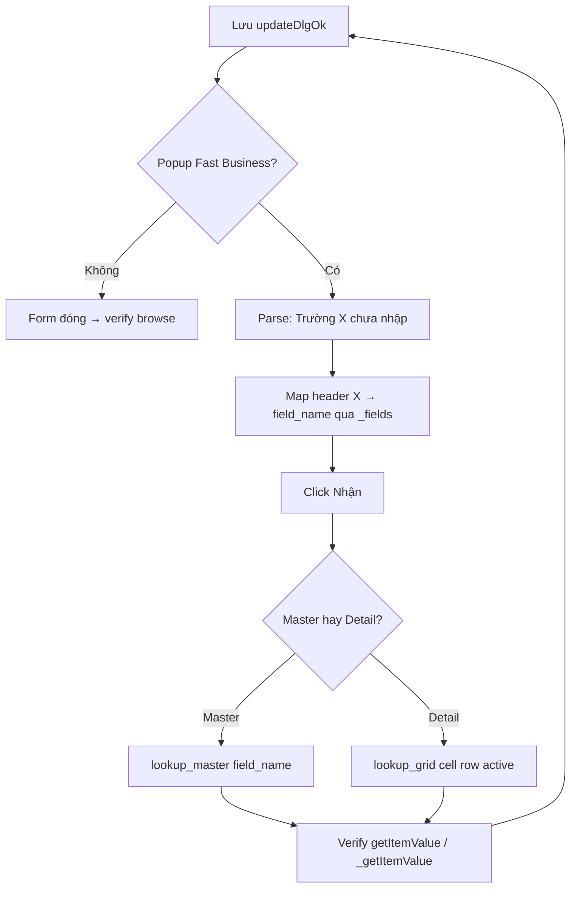
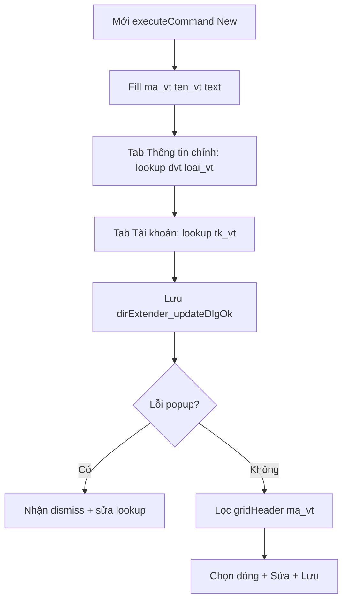

# 12 — FBO WebForms MainReport Runtime API (probe thực tế)

Tài liệu ghi nhận kiến thức runtime FBO Web **không có trong XML source** — thu thập qua Chrome CDP trên môi trường **BinhDienMK** (`172.168.5.14`).

> **Cập nhật dần:** mỗi lần agent/user trao đổi thêm kiến thức runtime → bổ sung vào file này. Khi đủ, user nhờ Gemini implement (`page_classifier.py`, mở rộng `chrome_debug` type=2/3/4).
>
> **Spec implement chi tiết:** [../doc_fix/fbo_runtime_page_classifier_spec.md](../doc_fix/fbo_runtime_page_classifier_spec.md)

---

## 1. Bối cảnh quan trọng

| Điểm | Chi tiết |
|------|----------|
| Stack UI | **ASP.NET AJAX** (`Sys.Application`, `$find`) — **không** dùng object ExtJS `f` / `g` trên lớp **MainReport** |
| Client ID | Sinh runtime (`ctl00_FastBusiness_MainReport`, …) — **không** có trong XML, **cấm hardcode** cho mọi dự án |
| Component trung tâm | `$find('...MainReport')` — grid browse, danh mục, báo cáo sau lọc |
| Môi trường test | VPN → `http://172.168.5.14/BinhDienMK/Main/...`, Chrome CDP `localhost:9222` |

**Khác với doc SP2263:** [10_fbo_sp2263_runtime_profile.md](10_fbo_sp2263_runtime_profile.md) mô tả pattern `f`/`g` trên **form chứng từ Dir** — doc này mô tả **MainReport WebForms** (browse / filter / report grid).

---

## 2. Phân loại màn hình — `_type`

Đọc từ component **MainReport** hoặc **searchExtender**:

```javascript
var mr = $find('...MainReport');
mr._type;
```

| `_type` | Loại FBO | Ví dụ |
|---------|----------|-------|
| `'Voucher'` | Chứng từ | `socthda.aspx` — Hóa đơn bán hàng |
| `'Report'` | Báo cáo (grid phase) | Sau khi lọc + Tìm trên `rpt_*.aspx` |
| `''` (chuỗi rỗng) | Danh mục | `invt.aspx` — Danh mục hàng hóa |
| `null` | Chưa xác định | Xem §2.1 |

### 2.1. Báo cáo — hai phase

Báo cáo có **2 phase** trong cùng trang:

| Phase | `MainReport._type` | `searchExtender._type` | UI |
|-------|-------------------|------------------------|-----|
| **Filter** (dialog điều kiện lọc) | `null` | `'Report'` | Popup "Điều kiện lọc", nút **Nhận** / **Hủy** |
| **Grid** (sau Nhận + Tìm) | `'Report'` | `'Report'` | Toolbar Tìm/Làm tươi + grid cột |

**Rule classify (user):**

```javascript
$find('...MainReport')._type
// 'Voucher'  → chứng từ
// ''         → danh mục
// 'Report'   → báo cáo (grid phase)
// null       → check searchExtender._type === 'Report' → báo cáo (filter phase)
```

---

## 3. Metadata field/cột — `_fields`

Trên **MainReport**, **searchExtender**, hoặc **dirExtender form**:

```javascript
component._fields   // Array
```

| Property | Ý nghĩa |
|----------|---------|
| `Name` | Tên field (`ma_vt`, `tu_ngay`, `ma_kh`…) |
| `HeaderText` / `Label` | Nhãn UI |
| `Type` | `String`, `DateTime`, `Decimal`, `Boolean`… |
| `AllowNulls` | `false` → **bắt buộc** trước Nhận/Lưu |
| `ReadOnly` | Không sửa được |

Agent dùng `_fields` để biết cột grid, field filter bắt buộc, và map **col index** khi gọi `_getItemValue` (§7).

---

## 4. Tìm component động (không hardcode ID)

Client id mẫu BinhDienMK (`ctl00_FastBusiness_MainReport`) **chỉ minh họa** — mỗi deploy/session có thể khác.

Pattern gợi ý (chạy qua `chrome_debug type=4`):

```javascript
(function () {
  var apps = Sys.Application.getComponents();
  var out = [];
  for (var i = 0; i < apps.length; i++) {
    var c = apps[i];
    var id = c.get_id ? c.get_id() : '';
    if (id.indexOf('MainReport') >= 0 || (c._type !== undefined)) {
      out.push({ id: id, _type: c._type, fields: c._fields ? c._fields.length : 0 });
    }
  }
  return out;
})()
```

**Selector DOM ổn định hơn id tuyệt đối:** dùng `[id*="MainReport"]`, `[id*="searchExtender_form_<field>"]`, `[id*="ToolbarButton_Search"]`.

---

## 5. Form / Filter — nhập liệu

### 5.1. `setItemValue(name, value)` — filter & form

Dùng trên **searchExtender** / **dirExtender** (không phải grid):

```javascript
var se = $find('...searchExtender');
se.setItemValue('ma_vt', '00131');   // sau khi chọn lookup
se.getItemValue('ma_vt');            // đọc lại
```

### 5.2. DateTime — ưu tiên DOM, không `setItemValue`

`setItemValue` cho `DateTime` có thể lỗi `n.format is not a function`.

**Cách đúng:** fill input DOM, format **`dd/MM/yyyy`**:

```javascript
function fillDom(name, val) {
  var el = document.querySelector('[id*="searchExtender_form_' + name + '"]');
  if (!el) return false;
  el.value = val;
  el.dispatchEvent(new Event('change', { bubbles: true }));
  el.dispatchEvent(new Event('blur', { bubbles: true }));
  return true;
}
fillDom('tu_ngay', '01/01/2024');
fillDom('den_ngay', '31/12/2025');
```

### 5.3. Lookup field — **bắt buộc chọn mã thật**

**Sai:** gõ tay mã không tồn tại (vd. `001`) → filter summary hiển thị nhưng **không hợp lệ**.

**Đúng:**

1. Bấm nút lookup cạnh field — icon `img.CellImgLookup` (class `CellImage CellImgLookup`)
2. Popup mở (vd. "Danh mục hàng hóa - vật tư")
3. **Click link** mã thật trên grid popup (vd. `00131`)
4. Verify input: `searchExtender_form_ma_vt` = `00131`
5. Bấm **Nhận**

Selector gợi ý lookup button:

```javascript
// Cạnh input ma_vt trong cùng td
document.querySelector('[id*="searchExtender_form_ma_vt"]').closest('td').querySelector('img.CellImgLookup')
```

Chọn mã trong popup (searchExtender / lookup báo cáo):

```javascript
// Click link text khớp mã
Array.from(document.querySelectorAll('a')).find(a => a.innerText.trim() === '00131').click();
```

### 5.4. Nhận diện field Lookup / AutoComplete — `dirExtender._fields`

Trên form danh mục/chứng từ popup (**dirExtender**):

```javascript
var f = $find('...dirExtender');
f._fields.filter(x => x.ItemStyle === 'AutoComplete' || x.ItemStyle === 'Lookup')
  .map(x => ({
    Name: x.Name,
    ItemStyle: x.ItemStyle,
    AllowNulls: x.AllowNulls,
    CategoryIndex: x.CategoryIndex,   // tab: 1=Thông tin chính, 2=Tài khoản, ...
    ItemController: x.ItemController  // UOM, ItemType, Account, ...
  }));
```

| `ItemStyle` | XML tương đương | Cách fill |
|-------------|-----------------|-----------|
| `AutoComplete` | `style="AutoComplete"` | **Lookup popup** — không gõ tay mã tùy ý |
| `Lookup` | `style="Lookup"` | Lookup popup |
| `Mask` / `null` | text thường | `setItemValue` / DOM |

**Vật tư `invt.aspx` — field bắt buộc (AllowNulls=false):**

| Field | ItemStyle | Tab | ItemController |
|-------|-----------|-----|----------------|
| `ma_vt` | Mask | header | — |
| `ten_vt` | — | header | — |
| `dvt` | AutoComplete | Thông tin chính | UOM |
| `loai_vt` | AutoComplete | Thông tin chính | ItemType |
| `tk_vt` | AutoComplete | **Tài khoản** | Account |

**Sai lầm đã gặp:** gõ `dvt = "Cai"` / `"Kg"` tay → validation fail. Phải **chọn** từ popup (vd. `Cái`).

### 5.5. FormLookup popup — **chuẩn chọn mã** (đã verify 2026-08-23)

> **Kiến thức đúng:** không gán thẳng `setItemValue('dvt', …)` / không gõ vào input form. Phải: mở lookup → lọc trên QuickFind popup → `quickFind()` → click dòng data → field mới được gán.

Sau khi bấm `img.CellImgLookup` cạnh field `{fieldName}`:

| Id component (pattern) | Vai trò |
|------------------------|---------|
| `...dirExtender_FormLookup{field}` | Popup lookup |
| `...FormLookup{field}_Button_Lookup` | AutoCompleteExtender — gọi `quickFind()` |
| `...FormLookup{field}_Button_Lookup_QuickFind` | Input **Tìm nhanh** |
| `...FormLookup{field}_Button_Lookup_Table` | Bảng kết quả (chứa chrome + data rows) |

**Luồng chuẩn (PASS — dvt → `Khối`):**

```javascript
// 1. Mở lookup (icon cạnh field — KHÔNG gõ vào form_dvt)
document.querySelector('[id*="dirExtender_form_dvt"]')
  .closest('td').querySelector('img.CellImgLookup').click();

// 2. Gõ từ khóa vào QuickFind của POPUP
var qf = document.getElementById(
  '...FormLookupdvt_Button_Lookup_QuickFind');
qf.value = 'khối';

// 3. Lọc — Enter hoặc (ổn định hơn) gọi API:
FastBusiness.AjaxControlExtender.AutoCompleteExtender
  .find('...FormLookupdvt_Button_Lookup')
  .quickFind();
// UI hiện: "Các bản ghi đang được lọc. Diễn giải thuộc %khối%."
// → Xem 1-1/1 bản ghi

// 4. Click dòng data đầu tiên trong Lookup_Table (link mã, VD "Khối")
//    Scope: #...FormLookupdvt_Button_Lookup_Table
//    BỎ QUA: Đóng, header Đvt/Diễn giải, Làm tươi, banner lọc

// 5. Verify — lúc này mới có giá trị
$find('...dirExtender').getItemValue('dvt');  // → "Khối"
```

**Thứ tự trạng thái field (bắt buộc hiểu):**

| Thời điểm | `getItemValue('dvt')` |
|-----------|------------------------|
| Trước lookup / sau QuickFind / sau `quickFind()` | `""` (vẫn rỗng) |
| Sau click dòng data trong popup | mã đã chọn (vd. `"Khối"`) |

**Áp dụng mọi field AutoComplete/Lookup** (`dvt`, `loai_vt`, `tk_vt`, `ma_vt` trên filter báo cáo…): cùng pattern `FormLookup{field}` + QuickFind + `quickFind()` + click dòng.

**Popup validation thiếu field:** alert *"Trường … chưa nhập…"* → bấm **Nhận** dismiss → bổ sung lookup còn thiếu (vd. `tk_vt` tab Tài khoản).

### 5.6. Focus dòng grid trước Sửa / Xóa (bắt buộc)

`executeCommand('Edit'|'Delete')` **không** mở form nếu chưa chọn dòng.

**Cách đúng đã PASS:**

1. Click cell cột dữ liệu đầu: `#...MainReport_gridCell_{row}.1` (row **1-based**, `.1` = cột ma_vt)
2. Verify: `mr._rowSelected() === true`, `mr._activeRow === row`
3. Click toolbar `#...ToolbarButton_Edit` / `_Delete` (hoặc `executeCommand`)
4. Xóa: confirm nút **Có**

```javascript
// Focus dòng 1
document.getElementById(mainReportId + '_gridCell_1.1').click();
// rồi mới
$find(mainReportId).executeCommand({ commandName: 'Edit', commandArgument: '0' });
```

Sai: chỉ `tr.click()` / gọi Edit khi `_activeRow` null → không mở `dirExtender`.

---

## 6. Báo cáo — workflow lọc đầy đủ (E2E đã test)

URL mẫu: `rpt_bkctsstt.aspx?id=15.02.39` — *Bảng kê chi tiết sổ sách, thực tế*


| Bước | Hành động | Verify |
|------|-----------|--------|
| 1 | Mở URL báo cáo | `searchExtender._type === 'Report'`, dialog filter hiện |
| 2 | Fill ngày qua DOM `dd/MM/yyyy` | Input có giá trị |
| 3 | Lookup `ma_vt` → chọn mã thật | Input = mã đã chọn (vd. `00131`) |
| 4 | Click **Nhận** | Dialog đóng; text filter: `Vật tư: 00131 - Đầu Trâu MK 001 30g, từ ngày ...` |
| 5 | Click **Tìm** | `MainReport._type === 'Report'`; grid header có cột |
| 6 | Đọc grid (nếu có data) | `_getItemValue` từng dòng/cột (§7) |

**Nút Tìm (bắt buộc sau Nhận):**

```
#...MainReport_ToolbarButton_Search
```

Class DOM: `ToolbarBackgroundImage TextSearch ToolbarTextButton` — tag `DIV`, text "Tìm".

**Nút Nhận filter:**

```
#...MainReport_searchExtender_updateDlgOk
```

**Lưu ý:** Nhận chỉ **áp điều kiện** lên toolbar/summary — **chưa chạy truy vấn**. Phải bấm **Tìm** (hoặc gọi `mr.search()` nếu cần qua JS).

**Kết quả test (2026-08-23):**

- Lookup `00131` → Nhận → filter summary đúng tên vật tư
- Sau Tìm: `row_count = 0` — **hợp lệ** (DB không có phiếu với điều kiện đó)
- Grid header 13 cột: `ngay_ct`, `ma_ct`, `so_ct`, `ma_kho`, `ten_kho`, …

---

## 7. Grid — đọc dữ liệu `_getItemValue`

**Mọi grid MainReport** (danh mục, báo cáo, browse) — khi đã có data sau Tìm — đọc qua:

```javascript
mr._getItemValue(rowIndex, colIndex)
```

### 7.1. Chữ ký — **cả row lẫn col đều 1-based**

| Gọi | Kết quả (invt.aspx) |
|-----|---------------------|
| `_getItemValue(1, 1)` | `"00131"` (ma_vt) |
| `_getItemValue(1, 2)` | `"Đầu Trâu MK 001 30g"` (ten_vt) |
| `_getItemValue(2, 1)` | `"001CP-30"` |

**Row 0 / col 0 → lỗi** — không dùng 0-based.

Col index = vị trí trong `_fields` + 1:

```javascript
// _fields[c].Name  ↔  col = c + 1
```

### 7.2. Pattern đọc toàn bộ grid

```javascript
(function () {
  var mr = $find('...MainReport');  // tìm động
  if (!mr || !mr._rows || !mr._rows.length) return { rows: [], row_count: 0 };

  var data = [];
  for (var r = 1; r <= mr._rows.length; r++) {
    var row = {};
    for (var c = 0; c < mr._fields.length; c++) {
      row[mr._fields[c].Name] = mr._getItemValue(r, c + 1);
    }
    data.push(row);
  }
  return { row_count: data.length, rows: data };
})()
```

### 7.3. `_rows` vs `_getItemValue`

| API | Nguồn | Ghi chú |
|-----|-------|---------|
| `mr._rows` | Cache server (mảng) | `_rows[i]` là array theo thứ tự cột — có thể map nhanh qua `_fields` |
| `mr._getItemValue(r, c)` | DOM grid đang render | Format đúng kiểu (`Decimal`, `DateTime`…); **grid phải đã load** |

Agent verify runtime: ưu tiên `_getItemValue` (giá trị user nhìn thấy). `_rows` dùng khi cần count nhanh hoặc cross-check.

### 7.4. Điều kiện tiên quyết

- Grid đã render (`gridTable` có `<tr>`) — danh mục thường auto-load; báo cáo cần **Tìm** trước
- Không scrape HTML `<td>` từng cell — dùng API component

---

## 8. Toolbar & lệnh

### 8.1. `executeCommand`

```javascript
$find('...MainReport').executeCommand({ commandName: 'New', commandArgument: '0' });
```

| commandName | Nút |
|-------------|-----|
| `New` | Mới |
| `Edit` | Sửa |
| `Delete` | Xóa |
| `View` | Xem |

Chứng từ (`_type='Voucher'`): **Mới** → mở `dirExtender` popup form.

### 8.2. Các method grid hữu ích (discovery)

| Method | Mục đích |
|--------|----------|
| `search()` | Chạy truy vấn (tương đương bấm Tìm) |
| `_getItemValue(r, c)` | Đọc cell |
| `_getRow` / `_getRowKey` | Row metadata |
| `get_searchInfor` / `set_searchInfor` | Thông tin điều kiện lọc |

---

## 8c. Chứng từ — `socthda.aspx` Hóa đơn bán hàng (probe 2026-08-23)

URL: `.../socthda.aspx?id=09.10.06` — `MainReport._type === 'Voucher'`, `typeof f === 'undefined'`.

| Bước đã test | Kết quả |
|--------------|---------|
| Classify | `page_kind=voucher` |
| Đọc browse grid | `_getItemValue` — `so_ct`, `ma_kh`, `ten_kh`, `t_tt_nt` OK |
| Focus dòng | Click `gridCell_{row}.4` (ô số ct) → `_rowSelected` |
| **Xem** | `ToolbarButton_View` → dirExtender `_type=Voucher`, đọc được `ma_kh`/`so_ct` |
| **Mới** + lookup | `ma_kh`, `tk` qua FormLookup + click dòng 1 — gán OK |
| **Detail grid `d81`** | Probe OK — xem §8d; lookup `ma_vt` + `so_luong` → **Lưu không báo lỗi validation** (2026-08-24) |
| **Lưu** | Cần master lookup (`ma_kh`, `tk`, `ma_tt`…) + ≥1 dòng detail |

**Required master (AllowNulls=false) sau Mới:** `ma_kh`, `tk`, `ma_gd`, `ma_tt`, `so_ct`, `so_seri`, `ngay_lct`, `ngay_ct`, `ma_nt`, `d81` (Grid), `tk_thue_no`.

**Khai báo detail (BinhDienMK SP2264 — luôn dùng path này):**

`\\172.168.5.14\CustomerPro\FBI\BINHDIENMK\SP2264\App_Data\Controllers\Grid\SVDetail.xml`

Script: `scripts/_probe_socthda.py`, `scripts/_test_socthda_e2e.py`, `scripts/_probe_socthda_detail_grid.py`, `scripts/_test_socthda_detail_save.py`.

---

## 8d. Grid chi tiết embed — `d81` / `SVDetail` (probe 2026-08-23)

**Nguồn XML:** [SVDetail.xml](file://172.168.5.14/CustomerPro/FBI/BINHDIENMK/SP2264/App_Data/Controllers/Grid/SVDetail.xml) — bảng `d81$`, controller `SVDetail`, type `Detail`.

| Runtime | Giá trị |
|---------|---------|
| Field master | `d81` — `ItemStyle: Grid`, `ItemController: SVDetail`, `CategoryIndex: 1` (tab **Chi tiết**) |
| Grid extender | `$find('{dirExtender}_FormGridd81')` — `_type: 'Detail'`, ~89 field |
| Thêm dòng | `#...FormGridd81_ToolbarButton_Insert` hoặc `executeCommand({ commandName: 'Insert' })` |
| **Không có** | `setItemValue` / `getItemValue` trên grid — dùng `_setItemValue(row, col, val)` / `_getItemValue(row, col)` |
| Cột 1-based | `col = g._fields.findIndex(f => f.Name === field) + 1` — vd `ma_vt→1`, `dvt→3`, `ma_kho→10`, `so_luong→18` |
| Cell DOM | `#...FormGridd81_gridCell_{row}.{col}` — input `#...FormGridd81_inputCell_{row}.{col}` |
| Lookup cell | Click cell → `img.CellImgLookup` → popup `{FormGridd81}_GridLookup{row}.{col}_Button_Lookup_*` |
| QuickFind grid | `{prefix}GridLookup{row}.{col}_Button_Lookup_QuickFind` + `AutoCompleteExtender.find(...).quickFind()` |
| Pick row | Click `<a>` dòng dữ liệu trong `...GridLookup{row}.{col}_Button_Lookup_Table` — **không** `_setItemValue` cho AutoComplete |
| **Sau lookup `ma_vt`** | `onChange$GridVoucherDetail$Item` thường **tự điền** `dvt`, `ten_vt`, tài khoản… — kiểm tra `_getItemValue` trước khi lookup lại |
| Selector DOM | ID chứa dấu `.` (vd `GridLookup1.3_...`) — **bắt buộc** `[id="..."]`, không dùng `#...` |
| Numeric cell | `fill` `#inputCell_{row}.{col}` + `change`/`onchange` — vd `so_luong` |
| Đóng popup lỗi | Click `#...GridLookup{r}.{c}_Button_Lookup_backgroundElement` hoặc `ext.hide()` |

**Required detail (AllowNulls=false trong SVDetail SP2264):** `ma_vt`, `dvt`, `tk_dt`, `tk_vt`, `tk_gv`, `ma_nx` (+ `ma_kho` từ SiteField).

**Grid thứ hai cùng form:** `FormGridd81kt` — grid kế toán/thuế (tab khác); agent fill `d81` trước khi Lưu.

```javascript
// Map field → cột
var g = $find(dirExtender + '_FormGridd81');
function col_of(name) {
  for (var i = 0; i < g._fields.length; i++)
    if (g._fields[i].Name === name) return i + 1;
}
// Lookup ma_vt row 1
// Playwright: click gridCell_1.{col_of('ma_vt')} → img.CellImgLookup → pick table row
```

---

## 8e. Popup validation — **sửa tại chỗ, không mở lại form** (bắt buộc agent)

Khi bấm **Lưu** / **Nhận**, FBO thường trả popup:

```text
Fast Business Online
Trường Mã khách chưa nhập hoặc giá trị nhập không hợp lệ.
[Nhận]
```

### Quy tắc agent (STRICT)

| ✅ Đúng | ❌ Sai |
|---------|--------|
| Đọc message → map tiêu đề → `field_name` → **Nhận** → fill/lookup field đó → **Lưu lại** | Thấy lỗi → **Hủy/đóng form** → Mới lại từ đầu |
| Giữ nguyên master + detail đã nhập | Bỏ cả phiếu vì thiếu 1 field |
| Lặp tối đa ~8 lần (mỗi lần sửa 1 lỗi) | Gõ tay mã lookup (`001`, `Khối`…) |



### Parse message → field

```javascript
// msg: "Trường Mã khách chưa nhập hoặc giá trị nhập không hợp lệ."
var m = msg.match(/Trường\s+(.+?)\s+chưa nhập/i);
var header = m ? m[1].trim() : null;

function resolveField(header, component) {
  for (var i = 0; i < component._fields.length; i++) {
    var f = component._fields[i];
    var h = (f.HeaderText || f.Label || '').trim();
    if (h === header) return { name: f.Name, col: i + 1, scope: component._type === 'Detail' ? 'detail' : 'master' };
  }
  return null;
}
```

**Map thường gặp (socthda / SVDetail):**

| Message (header) | field | Scope |
|------------------|-------|-------|
| Mã khách | `ma_kh` | master (`dirExtender`) |
| Tài khoản nợ | `tk` | master |
| Mã thanh toán | `ma_tt` | master |
| Mã hàng | `ma_vt` | detail row active |
| Mã lô | `ma_lo` | detail |
| Mã nx | `ma_nx` | detail |
| Mã kho | `ma_kho` | detail |

**Ví dụ hình user gửi:** popup *Mã khách* + ô master trống → agent **Nhận** → `lookup_select(ma_kh)` → verify `getItemValue('ma_kh')` ≠ `''` → **Lưu lại** (không Insert thêm dòng, không Mới lại).

**Sau lookup master:** luôn verify DOM/`getItemValue` — pick table thành công nhưng ô vẫn trống nếu popup lookup chưa đóng (`FormLookup*_backgroundElement`).

---

## 8b. Danh mục — CRUD vật tư `invt.aspx` (workflow agent)

URL: `invt.aspx?id=15.70.06` — `MainReport._type === ''`



| Bước | Hành động |
|------|-----------|
| Thêm | `executeCommand({ commandName: 'New' })` → fill + lookup bắt buộc → **Lưu** |
| Lọc | Input cột filter `ma_vt` trên `gridHeader` → `mr.search()` |
| Sửa | Click dòng grid → `executeCommand({ commandName: 'Edit' })` → sửa field → **Lưu** |
| Verify | `_getItemValue(r, c)` trên grid browse |

Script test: `scripts/_test_invt_lookup_dvt.py` (QuickFind dvt), `scripts/_test_invt_crud_e2e.py` (full CRUD).

---

## 9. URL test mẫu (BinhDienMK)

| Loại | URL | `_type` | Ghi chú |
|------|-----|---------|---------|
| Báo cáo | `.../rpt_bkctsstt.aspx?id=15.02.39` | filter: `null` → grid: `'Report'` | Lookup `ma_vt` bắt buộc |
| Danh mục | `.../invt.aspx?id=15.70.06` | `''` | 50 dòng/page; test `_getItemValue` |
| Chứng từ | `.../socthda.aspx?id=09.10.06` | `'Voucher'` | Xem/Mới+lookup OK; Lưu cần grid `d81` |

Base: `http://172.168.5.14/BinhDienMK/Main/`

---

## 10. Scripts test trong repo

| Script | Mục đích |
|--------|----------|
| `scripts/probe_fbo_three_screens.py` | Probe 3 loại màn hình |
| `scripts/_test_report_lookup_ma_vt.py` | E2E lookup + Nhận + Tìm |
| `scripts/_test_report_filter_e2e.py` | Fill filter (legacy — có gõ tay sai) |
| `scripts/_probe_grid_getItemValue*.py` | Verify chữ ký `_getItemValue` 1-based |
| `scripts/_test_invt_lookup_dvt.py` | Lookup dvt qua `FormLookupdvt` + QuickFind |
| `scripts/_probe_invt_fields_lookup.py` | Liệt kê `_fields` AutoComplete bắt buộc |
| `scripts/_test_invt_crud_e2e.py` | CRUD danh mục (Mới/Lọc/Sửa) |
| `scripts/_test_socthda_e2e.py` | Chứng từ HĐ: classify / grid / Xem / Mới+lookup |

Chạy (Chrome CDP bật):

```powershell
$env:PYTHONIOENCODING='utf-8'
.venv\Scripts\python.exe scripts\_test_report_lookup_ma_vt.py
```

---

## 11. Sai lầm thường gặp (agent)

| Sai | Đúng |
|-----|------|
| Gõ tay / `setItemValue` vào field AutoComplete | Lookup → QuickFind → `quickFind()` → click dòng |
| Click link đầu tiên trong popup (hay trúng "Đóng") | Scope `#...Button_Lookup_Table`, chỉ click dòng data |
| Bỏ qua `tk_vt` (tab Tài khoản) | Fill lookup trên đúng tab trước Lưu |
| Không dismiss popup lỗi | Bấm **Nhận** → sửa field → Lưu lại |
| Chỉ Nhận, không Tìm | Nhận → **Tìm** (`ToolbarButton_Search`) |
| Parse DOM `<table>` scrape text | `_getItemValue(row, col)` + `_fields` |
| Hardcode `ctl00_FastBusiness_*` | Tìm động qua `Sys.Application` / `[id*="MainReport"]` |
| `setItemValue` cho DateTime | DOM fill `dd/MM/yyyy` |
| `_getItemValue(0, 1)` (0-based row) | Row bắt đầu từ **1** |
| Expect `f`/`g` trên MainReport | Dùng `$find` + `_type` / `_fields` |

---

## 12. Mapping sang `chrome_debug` (future — Gemini)

| Nhu cầu | Tool | Ghi chú |
|---------|------|---------|
| Classify + `_fields` summary | type=2 + `runtime_hints` | `page_classifier.py` |
| Fill filter / click Nhận / lookup | type=3 | Mở rộng selector `searchExtender_form_*`, `CellImgLookup` |
| Verify grid / readonly | type=4 | Script `_getItemValue` loop |
| Đọc lỗi console | type=2 | Trước mọi tương tác |

Workflow agent: [05_agent_workflow.md](05_agent_workflow.md) §13 (báo cáo / danh mục).

---

## 13. Liên kết

- Workflow agent: [05_agent_workflow.md](05_agent_workflow.md)
- SP2263 profile (`f`/`g`): [10_fbo_sp2263_runtime_profile.md](10_fbo_sp2263_runtime_profile.md)
- showForm / FlowMulti: [11_fbo_showform_flowmulti_patterns.md](11_fbo_showform_flowmulti_patterns.md)
- Spec implement: [../doc_fix/fbo_runtime_page_classifier_spec.md](../doc_fix/fbo_runtime_page_classifier_spec.md)
- Probe raw JSON: [../doc_fix/_probe_three_screens_raw.json](../doc_fix/_probe_three_screens_raw.json)

---

## Changelog

| Ngày | Nội dung |
|------|----------|
| 2026-08-23 | Khởi tạo: `_type`, `_fields`, lookup ma_vt, workflow báo cáo Nhận+Tìm, `_getItemValue` 1-based |
| 2026-08-23 | Bổ sung: `dirExtender._fields` AutoComplete, `FormLookup{field}`, QuickFind dvt, danh mục CRUD invt, dismiss popup Nhận |
| 2026-08-23 | **Chuẩn lookup:** QuickFind + `AutoCompleteExtender.find(...Button_Lookup).quickFind()` + click dòng data — không gán thẳng input |
| 2026-08-23 | Focus `gridCell_{row}.1` trước Edit/Delete; confirm Xóa = **Có**; FilterPanel Playwright Enter |
